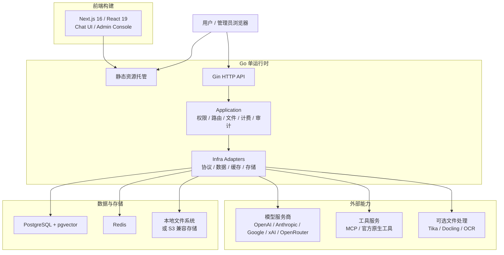

<p align="center">
  <picture>
    <source media="(prefers-color-scheme: dark)" srcset="./frontend/public/logo-white.svg" />
    
  </picture>
</p>

<p align="center">
  企业级模型路由、对话、文件、工具、计费、身份和运维的一体化 AI 平台。
</p>

<p align="center">
  <a href="../README.md">English</a> | 简体中文
</p>

<p align="center">
  <a href="https://deeix.com"></a>
  <a href="https://deeix.com/zh/docs/deeix-chat/quickstart"></a>
  <a href="https://t.me/deeix_chat"></a>
  <a href="https://x.com/DEEIX_AI"></a>
  <a href="https://www.apache.org/licenses/LICENSE-2.0"></a>
  
  
  
</p>

## 项目简介

DEEIX Chat 是一款开源可部署的 AI 平台，面向需要长期、稳定、统一使用多模型能力的个人、团队与企业。它用一个清晰的使用入口承载多个上游模型和服务商，将多模态对话、模型路由、文件与 RAG、MCP 工具、用量计费、身份认证、审计日志和运维控制整合到同一个产品中。

系统围绕简单部署、高效静态分发和低资源的运行时占用设计，轻量而不简陋、克制而不缺能力、开放而不失秩序。


## 核心能力

| 模块 | 能力 |
| --- | --- |
| 对话体验 | 面向日常高频使用的多模态对话界面，支持流式响应、多分支、重试、编辑、反馈、分享、富文本渲染和可追踪的模型执行信息。 |
| 模型与路由 | 以平台模型为统一入口管理上游渠道、真实模型、路由绑定、优先级、权重、熔断、厂商映射和能力配置，降低多供应商接入后的维护成本。 |
| 协议与适配 | 统一适配 OpenAI、Anthropic、Google/Gemini、xAI、OpenRouter 和 OpenAI 兼容协议，覆盖文本、图片、工具和不同厂商的原生能力差异。 |
| 文件与检索 | 提供文件上传、预览、提取、OCR、存储配额、全文注入、分片、向量嵌入和语义检索能力，让文件内容自然进入对话上下文。 |
| 工具生态 | 同时支持 MCP Server 和厂商官方原生工具，覆盖工具发现、启停、用户选择、执行限制、结果渲染和调用链路追踪。 |
| 上下文与记忆 | 支持消息窗口、Token 预算、压缩摘要、会话记忆、长期记忆和 RAG 证据记录，在可控成本下维持连续对话体验。 |
| Sub2 商业能力 | 订阅页通过当前登录用户的服务端 Sub2 session 读取余额、订阅、套餐、用量、支付和兑换状态；DEEIX 不保存本地账本、结算、价格或支付渠道权威数据。 |
| 身份与安全 | 通过 Sub2 完成登录、注册、改密和登录时 TOTP 验证；角色实时从 Sub2 刷新，DEEIX 仅保存资源归属投影、浏览器会话、HttpOnly Refresh Cookie 和加密的上游令牌。 |
| 管理与审计 | 后台只读展示 Sub2 用户投影并支持吊销 DEEIX 会话，同时管理上游、模型、路由、调用日志、审计日志、认证事件和系统事件。 |
| 部署与运维 | 支持单运行时托管前端与 API、Docker 部署、PostgreSQL + pgvector、Redis、S3 兼容存储、Swagger、结构化日志、版本接口、GeoIP 和 OpenTelemetry。 |

<p align="center">
  
  
</p>

<p align="center">
  
  
  
</p>

## 系统架构与技术栈

DEEIX Chat 采用前后端分离开发、单运行时部署的结构。前端构建为静态资源后由 Go 服务统一托管，API、权限、模型路由、文件、计费和审计等后端能力由同一个运行时提供；文档提取、OCR 等重型能力以可选服务接入，避免基础部署过重。



| 层面 | 职责 | 主要技术 |
| --- | --- | --- |
| 前端 | 用户对话、后台管理、静态构建 | Next.js 16、React 19、TypeScript、Tailwind CSS、Shadcn/UI、Streamdown、KaTeX、Mermaid、Recharts、Motion |
| 后端运行时 | API、认证授权、业务编排、协议适配、静态资源托管 | Go 1.26、Gin、Gorm、Swagger、OpenTelemetry、Zap |
| 数据与缓存 | 领域数据、向量检索、会话状态、运行时缓存 | PostgreSQL、pgvector、Redis |
| 文件与存储 | 上传文件、生成文件、对象存储和本地持久化 | 本地文件系统、S3 兼容对象存储 |
| 文件处理 | 文本提取、OCR、文档解析和 LLM OCR 回退 | 内置提取、Apache Tika、Docling、RapidOCR、Tesseract OCR、Paddle OCR、云 OCR 适配、MinerU |
| 工具协议 | MCP 工具接入和厂商官方原生工具调用 | MCP Streamable HTTP JSON-RPC、Provider Native Tools |
| 部署运行 | 应用与必需基础设施的统一部署 | Docker、Docker Compose、PostgreSQL/pgvector、Redis |

后端内部保持清晰分层：`cmd/internal/cli` 负责启动入口，`internal/app` 负责应用装配，`transport/http` 负责 HTTP 边界，`application` 负责业务用例与事务编排，`domain` 表达领域语义，`infra` 承载数据库、缓存、存储和外部协议实现。数据层按领域前缀组织表结构，财务流水、审计日志、系统事件和高增长向量数据保持独立事实源。

## 快速开始

> 快速安装教程：[快速开始](https://deeix.com/zh/docs/deeix-chat/quickstart)。

### 本地开发

本地开发适合改动源码并分别启动前后端。默认配置连接本机 PostgreSQL 和 Redis；需要本地运行栈时，使用下方唯一的 Full Docker 部署。

1. 准备后端配置：

```bash
cp config.example.yaml config.yaml
```

根据本机环境调整 `config.yaml` 中的 `database.postgres.dsn`、`database.redis.*` 和公开访问地址。

2. 安装工作区依赖并准备前端环境：

```bash
pnpm install
cp frontend/.env.example frontend/.env.local
```

3. 同时启动前端和后端：

```bash
pnpm dev
```

只启动单个工作区时，使用 `pnpm dev:web` 或 `pnpm dev:api`。

前端请求后端使用 `NEXT_PUBLIC_API_BASE_URL`。本地开发时确认 `frontend/.env.local` 中包含：

```env
NEXT_PUBLIC_API_BASE_URL=http://127.0.0.1:8080
```

访问地址：

| 服务 | 地址 |
| --- | --- |
| 前端 | `http://localhost:3000` |
| API | `http://localhost:8080` |
| Swagger | `http://localhost:8080/swagger/index.html` |

不配置 `NEXT_PUBLIC_API_BASE_URL` 时，本地默认指向 `localhost:8080`；同源部署默认请求当前 origin。

### Docker 部署

唯一支持的 Docker 部署使用根目录 `compose.yaml` 启动应用、PostgreSQL + pgvector 和 Redis，并把仓库根目录的 `config.yaml` 挂载到容器内 `/app/config.yaml`。迁移与在线更新说明见 [Agent Runtime Full deployment and online update](./agent-runtime/06-full-deployment-and-online-update.md)。

| 方案 | 适合场景 | 配置文件 | Compose 文件 | 内置依赖 |
| --- | --- | --- | --- | --- |
| Full 部署 | 本地开发、单机和生产部署 | `config.example.yaml` | `compose.yaml` | 应用、PostgreSQL + pgvector、Redis |

#### Full 部署

复制唯一配置样例，为部署环境替换开发密钥和公开地址，然后启动应用及其内置 PostgreSQL + pgvector、Redis 服务。

```bash
cp config.example.yaml config.yaml
docker compose -f compose.yaml up -d
```

`compose.yaml` 通过 `POSTGRES_DSN`、`REDIS_ADDR` 和 `REDIS_PASSWORD` 提供容器网络中的数据库与 Redis 连接配置，因此这些值会覆盖 `config.yaml` 中用于本地开发的连接值。

Compose 可从 `.env` 读取 `DEEIX_BIND_ADDRESS`、`DEEIX_HTTP_PORT`、`POSTGRES_USER`、`POSTGRES_DB`、`POSTGRES_PASSWORD` 和 `REDIS_PASSWORD`。应用端口默认绑定到 `127.0.0.1:8080`；远程部署可用以下 `.env` 固定监听地址和端口，而无需修改 Compose：

```dotenv
DEEIX_BIND_ADDRESS=0.0.0.0
DEEIX_HTTP_PORT=50001
SUB2_BASE_URL=https://api.ovload.com
```

`SUB2_BASE_URL` 是唯一的 Sub2 部署配置，默认值为 `https://api.ovload.com`。只有在 DEEIX 明确连接另一个兼容 Sub2 实例时才覆盖它；后端从规范化 origin 派生实例标识，浏览器不能提交上游地址。

#### v0.4 升级边界

v0.4 在修改 schema 前拒绝已填充的遗留 identity schema。先备份当前 PostgreSQL，再以新的 PostgreSQL 数据库或 volume 部署 v0.4。该 clean-slate cutover 没有数据迁移或兼容层，也不保留旧登录或旧聊天历史连续性。详见 [Full 部署与在线更新](./agent-runtime/06-full-deployment-and-online-update.md)。

#### 配置、持久化和镜像

配置优先级是：`环境变量 > config.yaml > 代码内置默认值`。`config.yaml` 负责品牌和静态基础设施、安全配置，例如品牌资源、服务地址、数据库、缓存、存储、GeoIP、Trace、JWT 和加密密钥。DEEIX 自有运行时业务配置存储在数据库中，并通过后台管理修改；身份、用户公告、余额、订阅、套餐、用量、支付和兑换只通过当前登录用户的服务端 Sub2 session 读取或修改。对话模型与展示分组来自管理员发布的 DEEIX 模型目录，默认 Sub2 密钥只在对话设置中选择，发送时静默使用。后端根据管理员模型协议配置与当前密钥分组解析实际请求协议，用户不再配置对话协议。

唯一 compose 栈会持久化应用数据：

| 数据 | 容器路径 |
| --- | --- |
| 上传文件和生成文件 | `/app/storage` |
| 应用版本和当前运行版本 | `/app/runtime` |
| 应用文件和更新日志 | `/app/data` |
| PostgreSQL 数据 | `/var/lib/postgresql/data` |
| Redis 数据 | `/data` |

默认应用镜像为 `ghcr.io/jhupo/deeix-chat:latest`。测试自定义构建时可通过 `DEEIX_CHAT_IMAGE` 覆盖：

```bash
docker build -t deeix-chat:local .
DEEIX_CHAT_IMAGE=deeix-chat:local docker compose -f compose.yaml up -d
```

稳定 tag 同时发布 Linux 全量应用包。Superadmin 可在“关于”页面检查、安装并重启应用；更新器通过 GitHub 官方 API 解析和下载 Release 资产，`app_runtime` 命名卷保证在线安装的版本在容器重启或重建后继续保留。服务器访问 GitHub 需要代理时，可把 `UPDATE_PROXY_URL` 设为 `http`、`https`、`socks5` 或 `socks5h` 转发代理。完整说明见 [Full 部署与在线更新](./agent-runtime/06-full-deployment-and-online-update.md)。

`APP_ENV` 支持 `dev`/`development` 和 `prod`/`production`，内部会规范化为 `dev` 或 `prod`；未配置时默认 `prod`。`dev` 只用于本地开发；公网生产部署应保持 `APP_ENV=prod` 或 `APP_ENV=production` 并使用生产密钥。

#### 可选安装服务

这些服务不是必须安装。只有在后台或 `config.yaml` 中启用对应文件处理能力时才需要启动。
这些 compose 文件会接入 `deeix-chat-network`；请先启动根目录 `compose.yaml`，或手动执行 `docker network create deeix-chat-network`。

```bash
docker compose -f docker/tika/docker-compose.yml up -d
docker compose -f docker/tesseract/docker-compose.yml up -d --build
docker compose -f docker/docling/docker-compose.yml up -d --build
```

默认本地地址：

| 服务 | 地址 | 用途 |
| --- | --- | --- |
| Tika | `http://127.0.0.1:9998` | 文档文本提取 |
| Tesseract OCR | `http://127.0.0.1:8004/ocr` | OCR 服务 |
| Docling | `http://127.0.0.1:8005/ocr` | 文档/OCR 提取 |

`docker/rapidocr` 当前提供 Dockerfile 和服务入口，但还没有 compose 文件。如果选择 RapidOCR，需要自行补 compose 或手动运行。

### 分离来源开发（不是部署 Profile）

Full Compose bundle 是唯一受支持的部署 Profile。以下内容仅说明在源码开发中如何以独立静态站点测试 API，不构成 v0.4 的替代部署拓扑或在线更新目标。

1. 配置公开地址。

   - 前端构建变量：`NEXT_PUBLIC_API_BASE_URL=https://api.example.com`
   - 后端配置：`server.public_api_base_url=https://api.example.com`
   - 后端配置：`server.public_web_base_url=https://chat.example.com`
   - 后端配置：`server.cors_allow_origin=https://chat.example.com`

   Docker 镜像构建时需要传入前端 API 地址：

   ```bash
   docker build --build-arg NEXT_PUBLIC_API_BASE_URL=https://api.example.com -t deeix-chat .
   ```

2. 构建并发布前端。

   ```bash
   pnpm install
   NEXT_PUBLIC_API_BASE_URL=https://api.example.com pnpm --filter @deeix/web build
   ```

   静态产物在 `frontend/out`，可由 Nginx、CDN、对象存储或任意静态服务托管。如需由 Go 后端托管前端，把 `frontend/out` 放到 `server.frontend_dist_dir` 指向的目录；Docker 镜像默认是 `/app/frontend/out`。

3. 配置 CDN 规则。

   | 路径 | 规则 |
   | --- | --- |
   | `/_next/static/*` | 缓存 1 年，并启用 immutable 静态资源缓存。 |
   | `/logo*.svg`、`/*.ico`、`/*.png`、`/*.jpg`、`/*.webp`、`/*.woff2` | 缓存 1 天到 30 天。 |
   | 所有导出的 `*.txt` 路由数据，包括 `/__next.*.txt` 和 `/setting/account.txt` 等嵌套文件 | 使用 `no-cache`，每次请求都重新验证。这些文件名跨版本保持稳定，不得设置固定 TTL。 |
   | `/`、`/*.html`、`/chat*`、`/agent*`、`/recent*`、`/files*`、`/setting*`、`/admin*`、`/share*` | 使用 `no-cache`，每次请求都重新验证。 |
   | `/api/*`、`/healthz`、`/readyz`、`/swagger/*` | 绕过 CDN 缓存，并完整转发请求头、方法、查询参数和请求体。 |

   首次应用这些规则时，需要清理 CDN 中已经缓存的导出 `*.txt` 和 HTML 路由对象，避免旧的一天 TTL 跨越本次部署继续生效。

   如果 CDN 从对象存储托管 `frontend/out`，需要开启路由回退，让无扩展名地址命中导出的 `<route>.html` 并保留原查询参数，例如 `/chat` -> `/chat.html`、`/agent` -> `/agent.html`。

### 启动后检查与首次登录

应用启动后，先确认健康检查、配置文件和启动日志。使用上文远程 `.env` 示例时：

```bash
curl http://127.0.0.1:50001/healthz
docker compose -f compose.yaml exec app ls -l /app/config.yaml
docker compose -f compose.yaml logs app
```

使用所配置 Sub2 实例中的用户登录。每次登录成功后，DEEIX 都通过 Sub2 `/api/v1/auth/me` 复核身份：Sub2 `admin` 映射为 DEEIX `superadmin`，Sub2 `user` 映射为 DEEIX `user`。DEEIX 不再创建本地初始管理员，也不会在日志中输出本地初始密码。

## 配置说明

> 完整配置说明：[配置说明](https://deeix.com/zh/docs/deeix-chat/configuration)。

后端配置分为静态运行配置和 DEEIX 自有运行时设置。静态运行配置用于描述品牌以及服务启动所需的基础设施、安全和存储参数，由 `config.yaml` 与环境变量提供；DEEIX 自有设置覆盖会话、模型和文件等应用行为，写入 `system_settings` 并通过后台管理维护。Sub2 身份与商业能力不是 DEEIX 运行时业务设置：BFF 使用当前服务端 Sub2 session，浏览器永不接收 Sub2 bearer token。环境变量会覆盖配置文件中的同名项，适合容器化、源码开发和密钥注入场景。

后端启动时会按运行目录解析默认配置文件：从仓库根目录启动读取 `config.yaml`，从 `backend/` 目录启动读取 `../config.yaml`。Docker 部署通常将宿主机 `./config.yaml` 只读挂载到容器内 `/app/config.yaml`；如果配置文件放在其他位置，请使用 `CONFIG_FILE` 指向实际运行环境可访问的路径。

前端品牌同样属于运行时配置。在 `config.yaml` 中设置 `branding` 后重启应用即可生效，无需重新构建前端或 Docker 镜像。详见[自定义品牌资源](./BRANDING.md)。

静态配置环境变量：

| 所属域 | 环境变量 | 说明 |
| --- | --- | --- |
| 前端构建 | `NEXT_PUBLIC_API_BASE_URL` | 浏览器请求后端 API 的地址；本地写入 `frontend/.env.local`，分离部署在构建时传入。 |
| 配置文件 | `CONFIG_FILE` | 可选配置文件路径；Docker 场景应填写容器内路径。 |
| 应用 | `APP_NAME` | 应用名称。 |
| 应用 | `APP_ENV` | 运行环境，支持 `dev`/`development` 和 `prod`/`production`；未配置时默认 `prod`。 |
| Sub2 | `SUB2_BASE_URL` | Sub2 规范 origin；默认 `https://api.ovload.com`，生产环境必须使用 HTTPS。 |
| HTTP 服务 | `HTTP_PORT` | API/运行时端口。 |
| HTTP 服务 | `CORS_ALLOW_ORIGIN` | 允许跨域访问的来源，多个来源用逗号分隔。 |
| HTTP 服务 | `TRUSTED_PROXIES` | 可信代理 CIDR 列表。 |
| HTTP 服务 | `PUBLIC_API_BASE_URL` | 对外 API 地址，用于链接、回调和公开地址生成。 |
| HTTP 服务 | `PUBLIC_WEB_BASE_URL` | 对外 Web 地址，用于链接、回调和公开地址生成。 |
| HTTP 服务 | `FRONTEND_DIST_DIR` | 前端静态产物目录。 |
| HTTP 服务 | `HTTP_READ_HEADER_TIMEOUT_SECONDS` | HTTP 读取请求头超时。 |
| HTTP 服务 | `HTTP_READ_TIMEOUT_SECONDS` | HTTP 请求读取超时。 |
| HTTP 服务 | `HTTP_IDLE_TIMEOUT_SECONDS` | HTTP keep-alive 空闲超时。 |
| HTTP 服务 | `HTTP_MAX_HEADER_BYTES` | HTTP 请求头最大字节数。 |
| 安全 | `JWT_SECRET` | JWT 签名密钥。 |
| 安全 | `DATA_ENCRYPTION_KEY` | Sub2 会话令牌、上游 API Key、MCP Token 和敏感设置的加密密钥材料。 |
| 安全 | `SSRF_PROTECTION_ENABLED` | 是否启用出站 SSRF 防护。 |
| 安全 | `SSRF_ALLOWED_HOSTS` | 部署级集成或可信私网重定向目标的主机名，逗号分隔。 |
| 安全 | `SSRF_ALLOWED_CIDRS` | 部署级集成或可信私网重定向目标的 CIDR 网段，逗号分隔。 |
| PostgreSQL | `POSTGRES_DSN` | PostgreSQL DSN。 |
| PostgreSQL | `POSTGRES_MAX_OPEN_CONNS` | 最大打开连接数。 |
| PostgreSQL | `POSTGRES_MAX_IDLE_CONNS` | 最大空闲连接数。 |
| PostgreSQL | `POSTGRES_CONN_MAX_LIFETIME_MINUTES` | 连接最长生命周期。 |
| PostgreSQL | `POSTGRES_CONN_MAX_IDLE_TIME_MINUTES` | 连接最长空闲时间。 |
| Redis | `REDIS_ADDR` | Redis 地址。 |
| Redis | `REDIS_USERNAME` | Redis ACL 用户名；使用仅密码或默认用户 Redis 时留空。 |
| Redis | `REDIS_PASSWORD` | Redis 密码。 |
| Redis | `REDIS_DB` | Redis DB 编号。 |
| Redis | `REDIS_TLS_ENABLED` | 启用 Redis TLS 连接，例如 Upstash Redis。 |
| Redis | `REDIS_TLS_INSECURE_SKIP_VERIFY` | 跳过 Redis TLS 证书校验；除非非标准端点确实要求，否则保持 `false`。 |
| 存储 | `STORAGE_BACKEND` | `local` 或 `s3`。 |
| 本地存储 | `STORAGE_ROOT_DIR` | 本地文件存储目录。 |
| S3 存储 | `STORAGE_S3_ENDPOINT` | S3 兼容服务 endpoint。 |
| S3 存储 | `STORAGE_S3_REGION` | S3 region；使用 S3 时必填。 |
| S3 存储 | `STORAGE_S3_BUCKET` | S3 bucket；使用 S3 时必填。 |
| S3 存储 | `STORAGE_S3_PREFIX` | S3 对象前缀。 |
| S3 存储 | `STORAGE_S3_ACCESS_KEY_ID` | S3 Access Key ID。 |
| S3 存储 | `STORAGE_S3_SECRET_ACCESS_KEY` | S3 Secret Access Key。 |
| S3 存储 | `STORAGE_S3_FORCE_PATH_STYLE` | 是否使用 path-style 访问。 |
| GeoIP | `GEOIP_PROVIDER` | `none`、`ipwhois`、`ipinfo` 或 `mmdb`。 |
| GeoIP | `GEOIP_BASE_URL` | GeoIP HTTP 服务地址，默认 `https://ipwho.is`。 |
| GeoIP | `GEOIP_TOKEN` | GeoIP 服务 Token。 |
| GeoIP | `GEOIP_TIMEOUT_MS` | GeoIP 请求超时。 |
| GeoIP | `GEOIP_DATABASE_URL` | MMDB 下载地址。 |
| GeoIP | `GEOIP_DATABASE_PATH` | MMDB 本地路径。 |
| GeoIP | `GEOIP_DATABASE_MAX_BYTES` | MMDB 最大下载字节数。 |
| GeoIP | `GEOIP_REFRESH_INTERVAL_HOURS` | MMDB 刷新间隔。 |
| OpenTelemetry | `OTEL_ENABLED` | 是否启用 Trace；未显式设置时，配置 endpoint 会自动启用。 |
| OpenTelemetry | `OTEL_EXPORTER_OTLP_ENDPOINT` | OTLP Collector 地址。 |
| OpenTelemetry | `OTEL_EXPORTER_OTLP_HEADERS` | OTLP 请求头，格式为 `key=value,key2=value2`。 |
| OpenTelemetry | `OTEL_EXPORTER_OTLP_INSECURE` | 是否使用明文传输。 |
| OpenTelemetry | `OTEL_EXPORTER_OTLP_PROTOCOL` | OTLP exporter 协议：`grpc`、`http` 或 `http/protobuf`；默认 `grpc`。 |
| OpenTelemetry | `OTEL_TRACES_SAMPLER_ARG` / `OTEL_SAMPLING_RATE` | Trace 采样率，范围 `0~1`；`OTEL_TRACES_SAMPLER_ARG` 优先。 |

DEEIX Token 有效期、限流、登录后路径、会话配置、管理员发布的模型目录与分组、模型参数策略、文件处理、RAG、Embedding 和 MCP 属于运行时业务配置。登录、注册、邮箱验证、登录因子、用户角色、账户状态、用户公告、计费和支付由 Sub2 管理，DEEIX 不再复制这些权威数据。

生产环境启用 SSRF 防护后，管理员保存的模型、MCP 和 Embedding endpoint 按精确 origin（协议、主机和端口）获得局部授权，不需要加入全局白名单。跨 origin 的公网重定向可以继续访问，跨 origin 的私网重定向必须命中 `SSRF_ALLOWED_HOSTS` 或 `SSRF_ALLOWED_CIDRS`。模型生成的图片或视频由后端下载、校验并转存；私网制品 URL 只有与本次选中的模型 endpoint 同 origin 时才继承局部信任。`SUB2_BASE_URL` 独立按规范 origin 校验，且重定向不得改变 origin。链路本地、组播、未指定地址和已知云元数据目标始终禁止。

## 功能指南

- [用户指南](https://deeix.com/zh/docs/deeix-chat/new-chat)
- [管理指南](https://deeix.com/zh/docs/deeix-chat/admin-accounts)
- [进阶指南](https://deeix.com/zh/docs/deeix-chat/advanced-capabilities-passthrough-tools)

## 安全说明

- 密码、注册验证因子和登录时 TOTP 由 Sub2 处理，DEEIX 不持久化这些数据。
- 生产模式会拒绝不安全的默认密钥、过短的加密密钥、通配 CORS 和非 HTTPS 公开地址。
- DEEIX Refresh Token 只存储哈希；每个浏览器会话独占的 Sub2 Access/Refresh Token 使用 `DATA_ENCRYPTION_KEY` 通过 AES-GCM 加密。
- DEEIX Access Token 为短期令牌并保存在前端内存中；DEEIX Refresh Token 由后端写入 HttpOnly Cookie，Sub2 Bearer Token 不进入浏览器。
- 用户输入的模型参数会在请求上游前经过白名单/黑名单过滤。模型名、消息、工具、系统提示词、请求头和 previous response 标识等系统链路字段不允许被用户 options 覆盖。

## 文档入口

- [普通聊天 + Agent Runtime / Codex app-server 并存设计](./agent-runtime/README.md)
- [快速开始](https://deeix.com/zh/docs/deeix-chat/quickstart)
- [配置说明](https://deeix.com/zh/docs/deeix-chat/configuration)
- [用户指南](https://deeix.com/zh/docs/deeix-chat/new-chat)
- [管理指南](https://deeix.com/zh/docs/deeix-chat/admin-accounts)
- [进阶指南](https://deeix.com/zh/docs/deeix-chat/advanced-capabilities-passthrough-tools)
- 后端说明：[backend/README.md](../backend/README.md)
- 后端规范：[backend/docs/README.md](../backend/docs/README.md)
- 前端说明：[frontend/README.md](../frontend/README.md)
- 贡献指南：[CONTRIBUTING.md](../.github/CONTRIBUTING.md)
- 安全策略：[SECURITY.md](../.github/SECURITY.md)
- Swagger UI：`http://localhost:8080/swagger/index.html`

## 鸣谢

DEEIX Chat 基于开源生态构建，感谢所有 AI 工具生态中的维护者和社区。

- [Next.js](https://nextjs.org)
- [Go](https://go.dev)
- [LINUX DO](https://linux.do)

## 联系&交流

- 官网：[deeix.com](https://deeix.com/)
- 博客：[blog.cheny.me](https://blog.cheny.me/)
- 邮箱：[support@deeix.com](mailto:support@deeix.com)
- Telegram：[t.me/deeix_chat](https://t.me/deeix_chat)
- 推特 / X：[@DEEIX_AI](https://x.com/DEEIX_AI)

## 开源协议

DEEIX Chat 使用 [Apache License 2.0](../LICENSE) 授权。
