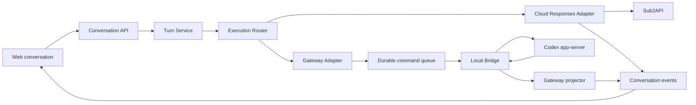

# 统一会话架构

## 1. 聚合边界

`Conversation` 负责用户可见的标题、项目、消息、Run、分享和执行绑定。Gateway 的 thread/turn/item 是 Adapter 私有状态，不能成为另一套 Web 产品模型。

执行绑定在创建 Conversation 时显式提交：

- `cloud`：不允许携带设备、Profile 或 Workspace。
- `gateway`：三个目标 ID 都必填，并在当前用户下校验设备有效、Profile 已证明、Workspace 可用。

绑定创建后不可修改。需要换设备或工作目录时创建新 Conversation，保证 provider thread、cwd、审批和附件授权只有一种解释。

## 2. 应用服务

`Turn Service` 先读取 Conversation，再按 `execution_type` 分发：

| 组件 | 输入 | 输出 |
| --- | --- | --- |
| Cloud execution | Conversation、消息、Chat key、模型选项 | Sub2API Responses 流和统一 Run/Event |
| Gateway execution | Conversation、文本、附件、provider 设置 | 强类型 Gateway command 和统一 Run/Event |
| Conversation projector | 规范化执行事件 | Message、Run、每会话递增事件序列 |

Conversation application 只依赖窄接口 `GatewayExecutor`。应用装配层把 Agent Gateway 服务适配到该接口，Conversation 包不引用具体实现。

## 3. 多网关

关系为 `User 1:N Device 1:N RuntimeProfile 1:N Workspace`。每台设备拥有独立 credential、WSS、下行序列和命令队列。通知按用户唤醒，socket 仍只读取自身 device 队列。

一个 Conversation 只绑定一个设备目标；不同 Conversation 可以同时绑定同一用户的不同设备。数据库用 `AgentThread.conversation_id` 唯一约束保证一个 Gateway Conversation 只有一个内部 provider thread。

## 4. 事件可靠性

Gateway 上行事件先和 Agent 投影在同一事务落库，并进入待投影 outbox。投影成功后才标记完成：

1. Bridge 以连续 `bridge_seq` 上报。
2. Agent repository 幂等写 `AgentEvent` 和 projection outbox。
3. Conversation projector 用 `source_key=agent:<event_public_id>` 去重。
4. 锁定 Conversation，分配严格递增 `execution_event_seq`。
5. delta/reasoning 更新 assistant message；terminal 更新 Message 与 Run。
6. 成功后确认 outbox，失败可重试。

Cloud 语义事件使用相同 Conversation event 表。逐 token 文本和推理 delta 只走实时流，不逐条写数据库；有业务意义的 RAG、usage、工具状态与 terminal 事件持久化。

## 5. 信任边界

- Browser user ID 只来自登录会话，不接受请求体指定。
- JSON body 限长、拒绝未知字段、只允许一个 JSON value，并执行 DTO validation。
- Gateway 设置使用 allowlist；未知选项直接报错。
- Artifact 由 Cloud 校验 ownership 后生成 opaque ref；命令不携带任意本地路径。
- Bridge 才能解析 canonical cwd、provider raw ID 和本机授权。
- 任意 JSON 命令入队入口不存在，只有强类型应用服务方法可以创建命令。
- `execution_type` 没有数据库默认值；创建方必须明确选择 Cloud 或 Gateway。
