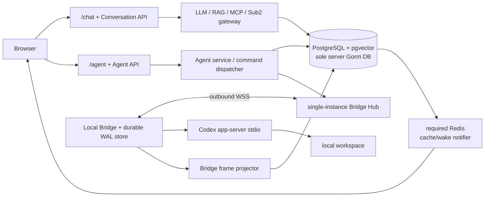

# 目标架构

> 实现状态：普通 `/chat` 已通过设置页选定的默认 Sub2 key binding 静默执行；对话页不展示 key selector。模型与展示分组只读取 DEEIX 管理员发布目录，不依赖 Sub2 `/v1/models`。`/agent`/Work 不使用 Chat binding。本文其余 Bridge、Work 与 Codex app-server 内容是目标架构。

## 1. 两个执行域

现有 `conversation.Service` 在 `backend/internal/app/app.go:261+` 装配 channel、LLM、MCP、RAG、embedding、文件处理、媒体与 billing。普通聊天以 `Conversation -> Message -> Run` 为聚合，`repository_project.go:137+` 的删除事务会删除 Conversation 或解除其 ConversationProject 归属。Agent 不进入这条关系。clean-slate cutover 保留该聚合和 Web surface，但以 08 的 Sub2 key binding/gateway execution 替换 local billing authorization、reservation 与 settlement。

Agent 使用独立 `AgentThread -> AgentTurn -> AgentItem` 投影，另有 `AgentInteraction`、`AgentEvent`、`AgentCommand`。两个域共享认证、用户、审计、数据库连接、object storage 和页面外壳；它们不共享发送 endpoint、消息 DTO、执行状态机、MCP loop 或 reducer。



## 2. 组件责任

### 2.1 Existing Chat Runtime

- 保留 `/chat`、`/api/v1/conversations/*`、Conversation/Message/Run 表和现有 LLM/RAG/server-MCP/DB Skill/media/share/export 行为。billing UI/BFF routes 仍保留，但本地商业授权、预留、结算和 ledger 按 08 删除；Run 固定 Chat-only Sub2 key binding 后由 Sub2 gateway 判定执行资格。
- `generation_stream.go` 的 replay 是 user/run-scoped。Agent 借用其 retained replay、subscriber buffer 和 overflow 处理模式，独立实现 thread-scoped query、cursor 与 notifier key。
- 聊天故障与已运行的本地 Agent turn 相互隔离；Bridge 离线期间聊天发送保持可用。

### 2.2 Agent HTTP API 和 Agent service

- 验证 user 对 device、runtime profile、workspace、thread、turn、interaction 和 artifact ref 的关联；所有 mutation 接收 `Idempotency-Key`。
- 每个 HTTP mutation 先完成 authentication、DTO 语法/大小/枚举校验并计算 request hash，再在同一事务 claim/read `agent_idempotency_records`。同 key/op/hash 直接重放首个 committed response；新 record 才继续 aggregate state 校验、变更、必要 command 与 response 保存。labels 与 share policy 使用同一流程。
- 创建 `agent_commands` 行并原子分配 `server_seq`，写 command audit，再让 Hub 唤醒连接。
- 处理 thread/turn/interaction/resource 查询，提供 thread-scoped NDJSON replay，签发文件 transfer ticket。
- 不持有 provider credential、canonical cwd 或 raw provider request ID；也不拼装 chat 模型上下文或执行 server-MCP。

### 2.3 Command dispatcher 与 Bridge Gateway

- Hub 只维护当前进程的 device socket、connection epoch、heartbeat 与背压。首版一个应用实例，Hub 数据不承担恢复职责。
- command dispatcher 以 `server_seq > last_acked_server_seq` 选择每个 device 的下一行，而非仅按业务 status 筛选。Dispatcher 在 WSS write 前 durably marks the first delivery attempt. 仅 queued 且未开始 delivery 的取消、过期或 terminal failure 才转为同一 command ID/server_seq 的 typed tombstone/no-op；一旦 execute delivery 可能到达 Bridge，cloud 不再直接 terminalize 或替换为 tombstone。明确证明 write acceptance 前的 transport failure 仅可通过同一 serialized CAS 清除 nullable `delivery_started_at` ownership marker 后 requeue，同时保留 attempt/audit metadata；无法证明 zero acceptance 的 write/connection loss 保持 delivery-started，并以同一 command ID/seq resend 给 Bridge WAL/cache/recovery dedup。Bridge incoming-command WAL records `received`, `invocation_started` (with typed recovery data/precondition) or `terminal_cached` (normalized result/error). Tombstone 持久化后推进连续 ack，不调用 provider；普通 execute 命令先查 command-ID result cache：命中时重发已存 result/error，不调用 provider；未命中时先持久化 `invocation_started`，再解析 source refs、调用 `ProviderAdapter`、持久化 normalized result/error，最后发 durable up-frame。普通 ack 表示 receipt/WAL durability 而非 provider completion；delivery-started 命令由 Bridge terminal result/error/recovery (`completed`, normalized failure 或 `outcome_unknown`) 结算。`transfer.execute` 仍先写只含 `serverSeq`、command/ticket refs 的 sanitized incoming record，再取得并持久化 claim receipt 后才推进 ack，随后 suffix 才继续下发。
- Gateway 在接收上行 durable frame 后调用 projector。只有数据库事务提交成功才发送 `ackBridgeSeq`。
- WSS control frame 处理 hello/welcome/ping/pong/ack；control frame 不占 durable command sequence。

### 2.4 Event projector

- 所有 Bridge 上行 durable frame 都先以 `(device_id, bridge_seq)` staged inbox evidence 记录，包含 command result、command error、profile snapshot、device state 和 provider event；receipt 与 projection 分离。
- `last_acked_bridge_seq` 始终是最大连续已 applied/projected cursor，而不是最大已持久化 cursor。若 `bridge_seq > last_acked_bridge_seq + 1`，事务只保存 staged frame 并只 ack 该连续 cursor，不投影且不分配 `thread_seq`。下一个连续 frame 到达时，按 `bridge_seq` 应用它并 bounded-drain 后续连续 staged run；每个 frame 在 PostgreSQL row-lock/upsert/unique-constraint serialization 下原子投影、分配 `thread_seq` 并推进 cursor。staged/applied duplicate 均为 no-op；post-commit Redis wake/worker 可继续 bounded drain。
- 没有 thread 的 frame 只更新 device/profile/resource/command projection；其 `agent_events.thread_id` 和 `thread_seq` 均为 NULL。这样不增加第二个 cloud inbox 表。
- item delta、completed 和 interaction event 通过 Bridge-issued source ref upsert 投影。item completed 与 turn completed 是终态来源，旧 delta 不回退终态。

Agent command/projection persistence uses PostgreSQL with pgvector as the sole server Gorm database. Row locks, upserts, unique constraints and partial indexes serialize device `server_seq`, thread `thread_seq`, bridge-frame dedupe/projection and HTTP idempotency claim/replay. Transactions never perform socket, provider, object or other network I/O. PostgreSQL integration tests cover crash rollback without duplicated sequence, command or event. Redis is required for cache/wake behavior, but database replay remains authoritative.

### 2.5 Local Bridge

- 管理 device credential、WSS reconnect、private Bridge durable WAL store、incoming command result cache、runtime profiles 和 provider subprocess。该嵌入式本地 store 只承担 Bridge crash/reconnect durability，不定义或替代服务端数据库。启动时先 initialize provider、ingest/reconcile provider state/events 与 source mappings，再严格按 `server_seq` drain incoming commands：tombstone 不调用 provider，`terminal_cached` 重发，`received` 且未开始 invocation 执行；`invocation_started` 但无 cached terminal 绝不盲目重试。带 expiry 的 typed command 携带 allowlisted `expiresAt`/deadline；Bridge 在 invocation 前及 recovery 时检查它。delivery 已发生但 expiry 前尚未 invocation 时，Bridge cache/emit normalized `expired`，不调用 provider；invocation 已开始或被 provider 接受时，deadline 不在 cloud 制造终态，仍由 typed recovery 结算。该 indeterminate state 由 typed per-operation recovery registry 处理：证明 postcondition/source binding 后 synthesize/cache normalized result，证明未应用后允许一次执行，或 cache/emit terminal `outcome_unknown` 并要求 inspection/reconciliation；safe read-only operation 可标为 retryable。恢复结果/error 在 durable up-frame 前持久化，JSON-RPC 不被视为 universal exactly-once，也不承诺 generic cancellation of an accepted provider mutation。
- 维护持久 raw ID mapping：`(profile_ref, source_kind, source_ref) -> raw provider ID`。首次见到 raw ID 时先写 Bridge durable WAL store/registry mapping，再发送含 source ref 的上行 frame；云端从不接收 raw ID。
- workspace registry 维护 `workspace_id -> canonical root`，解析 symlink/junction，核验 cwd 和 file ref 位于 root 内。
- 将 cloud `AgentCommand` 变换为 local `ProviderCommand`，调用 ProviderAdapter；将 notification、server request、result 和 error 归一化为 Bridge frames。
- provider credential、secret、canonical path、raw config 与 raw app-server ID 停留在本机；云端只存脱敏投影、public ID 或 Bridge-issued source ref。resolver 以 source ref 查询本地 mapping 后才填充 local `ProviderCommand` raw ID 字段。

## 3. 数据所有权与工作区

| 数据 | 事实源 | 云端使用 |
| --- | --- | --- |
| Conversation/Message/Run | DEEIX database | 普通聊天执行、恢复、分享、导出，以及 Sub2 request/usage/external-ID audit；不保存本地金融计费事实 |
| provider thread/session | local app-server/session store | AgentThread projection、历史与审计 |
| local workspace files | device | workspace metadata、file ref、按需 transfer |
| provider credentials/config secrets | device | auth/configured status，不存 secret |
| Agent commands/projections | PostgreSQL + pgvector | durable intent、Web query、replay、audit |
| bridge outgoing frames/results | private Bridge durable WAL store | 上行续传和 command result de-duplication |

Workspace registry 可由本地 picker 或本地 thread cwd discovery 创建。Web 只传 opaque workspace public ID。Bridge canonicalize 后登记 local ref；一个 AgentThread 固定一个 workspace。云端分组字段是 device、workspace、runtime profile、labels 和 metadata，Thread 表没有 `project_id`。

## 4. 连接与启动时序

```mermaid
sequenceDiagram
  participant B as Bridge
  participant S as Agent Gateway
  participant D as PostgreSQL + pgvector
  participant C as Codex app-server
  participant W as Web

  B->>S: WSS upgrade with Sec-WebSocket-Protocol
  B->>S: hello(ackServerSeq, ackBridgeSeq, manifests)
  S->>D: lock device; validate credential; load command cursor
  S-->>B: welcome(epoch, authoritative bridge cursor, heartbeat)
  S->>D: claim commands server_seq > ackServerSeq
  S-->>B: command(serverSeq, commandId)
  B->>B: WAL received/cache or persist invocation_started
  B->>C: cache miss: ProviderAdapter.execute
  C-->>B: notifications / server request / result
  B->>B: WAL outgoing bridgeSeq frame
  B->>S: event/result(bridgeSeq)
  S->>D: stage/dedupe; project only contiguous bridgeSeq run
  S-->>B: ackBridgeSeq
  S-->>W: committed thread event notification
```

Bridge sends profile manifest and workspace/resource snapshot after adapter startup. Before draining incoming commands it initializes provider and reconciles provider state/events plus source mappings. A `schema_mismatch` profile remains diagnosable but command dispatcher does not select it for execution. Commands issued while device is offline remain `queued` and Web shows `waiting_for_device`.

## 5. Turn 与 interaction 时序

```mermaid
sequenceDiagram
  participant W as Web
  participant S as Agent service
  participant B as Bridge
  participant C as Codex

  W->>S: POST thread with optional input + Idempotency-Key
  S->>S: persist AgentThread + optional awaiting_thread turn + thread.create
  S-->>B: thread.create(serverSeq)
  B->>C: thread/start (settings only)
  C-->>B: thread started result/event
  B-->>S: event(bridgeSeq)
  S->>S: bind source ref; allocate one turn.start for awaiting turn
  S-->>B: turn.start(serverSeq)
  B->>C: turn/start (stored input)
  C-->>B: turn/item notifications
  B-->>S: event(bridgeSeq)
  S-->>W: AgentEvent(thread_seq)
  C->>B: server request approval/input
  B-->>S: interaction.requested(bridgeSeq)
  W->>S: POST interaction response
  S->>S: pending -> responding CAS; persist command
  S-->>B: interaction.respond(serverSeq)
  B->>C: JSON-RPC response with local request ID
  C-->>B: resolved, item.completed, turn.completed
```

The browser never sends a provider method or JSON-RPC ID. It references Agent public IDs. A one-submit initial-input flow visibly advances through queued `thread.create` then queued `turn.start`; source binding transaction/unique guard ensures duplicate result or restart does not produce another initial turn command. On recovery after `thread.create` or its follow-on `turn.start` reached `invocation_started`, Bridge reconciles provider thread/turn state and source mappings before dispatch. A recovered source binding enters the existing cloud conditional transition plus partial unique, so it creates no second initial turn command; ambiguous provider acceptance produces `outcome_unknown`/inspection rather than another provider thread or turn. Bridge maps interaction public ID to local provider request ID and returns cached result when a command is delivered twice.

## 6. 文件与工件传输

### 浏览器到 workspace

1. Browser uses current object-storage upload path and receives upload metadata.
2. Agent service validates User/workspace ownership, writes an `agent_transfer_tickets` row and returns its opaque public ref; the row stores only token hash, hash/size/MIME, direction and refs.
3. Dispatcher persists a typed `transfer.execute` command containing only `transferTicketRef` and allowlisted public/source refs, then rebuilds and hash-verifies the bearer only for its ephemeral WSS delivery. Bridge validates the envelope and persists a sanitized incoming record with `serverSeq`, command ID and ticket refs, but no bearer; it uses the in-memory bearer once to claim the ticket.
4. Claim CAS returns a durable non-secret receipt bound to User, device, command and ticket. Bridge persists that receipt before advancing/acking the command `serverSeq`, then zeroes the bearer. Directional data transfer uses Bridge device authentication plus the persisted receipt, not the bearer; Bridge validates user/device/workspace/direction, size/hash/MIME, canonical root and file ref before adding an app-server local input. A terminal result consumes the claim once and retains only redacted receipt metadata in Bridge WAL/result data.
5. Hash mismatch or transfer failure marks ticket failed, and retention removes expired ticket rows, staging files and eligible temporary objects.

### workspace 到浏览器或 share

Bridge resolves signed file ref, validates workspace/root again, chunks through a short-lived upload ticket, and reports progress as thread-visible artifact events. Full workspace mirroring is absent. Share snapshots use redacted item/artifact projections and omit command environment, absolute paths and config secrets.

## 7. 恢复模型

### Browser reconnect

Browser reconnect with a mounted reducer subscribes to the Redis-backed notifier first, then replays `GET /api/v1/agent/threads/:thread_id/events?after_seq=lastAppliedSeq` strictly from the existing `lastAppliedSeq`; it never overwrites that cursor from a thread header. Cold load, cursor gap or compaction recovery also subscribes first, then fetches one atomic aggregate snapshot containing thread, included turns/items/interactions and `snapshotSeq` from one PostgreSQL read snapshot. It replaces reducer state, sets `lastAppliedSeq=snapshotSeq`, then replays events `> snapshotSeq`. Notifier messages are wake-ups only, so every wake queries again.

### Bridge reconnect and server restart

Bridge hello reports contiguous `ackServerSeq` and `ackBridgeSeq`. `ackServerSeq` is Bridge's contiguous durable receipt cursor for cloud-to-Bridge commands; after credential/epoch/range/contiguity validation against allocated command rows, server advances `last_acked_server_seq` and marks covered commands acked. `ackBridgeSeq` is only Bridge's last observed cloud acknowledgement for diagnostics/reconciliation and never advances cloud `last_acked_bridge_seq`. `welcome` returns the cloud authoritative `last_acked_bridge_seq`; Bridge resends durable WAL frames strictly above that returned cursor, so a stale or higher hello `ackBridgeSeq` cannot suppress resend or advance the cloud cursor. PostgreSQL serializes the device cursor, then the server resends every `agent_commands.server_seq > last_acked_server_seq`, including typed tombstones only for rows terminalized before their first delivery attempt. For transfer, a crash before durable claim receipt/ack produces this normal redelivery and re-derives the same bearer; after receipt/ack, Bridge resumes with its persisted receipt and no bearer. PostgreSQL survives API restart; the new Hub resumes delivery when Bridge reconnects. Bridge durable WAL store writes tombstones before ack and replays each unacked `bridge_seq` in order.

### Provider process restart

Bridge restarts app-server, emits profile state, initializes its adapter, then reads provider thread/turn state to reconcile projections and source mappings before strict `server_seq` incoming-command drain. Completed provider turns receive final events; a projected in-progress turn with no active provider turn becomes `interrupted` with a normalized reason. An `invocation_started` command with no cached terminal uses its typed recovery policy and never blindly executes; cached incoming command results remain until the command retention window closes.

### Device revoke

Device revoke first enters `revoking`: it blocks new user commands and ordinary credential issuance, terminalizes only never-delivered work and pending interactions, and permits a narrow settlement-only Bridge connection for delivery-started work. Through existing `token-challenges` plus `tokens`, a fresh device-key-signed challenge may issue a short-lived one-use `settlement` token bound to current credential version and immutable upper already-delivery-started `server_seq`; ordinary/new-work issuance remains blocked. That epoch permits only bounded resend/ack, terminal/recovery/provider frames and existing transfer receipt/data for that set, never new commands/resources/transfers or unrelated frames. Repeat disconnect may obtain another one-use settlement token while work remains; final revoke/credential rotation invalidates it. It does not directly cancel delivery-started commands or linked responding interactions; where a typed local cancellation such as turn interrupt exists it may be requested, otherwise Bridge result/recovery/`outcome_unknown` settles the work. Offline unsettled devices remain `revoking`; first release has no force-terminal UI. After acknowledged/delivery-started work settles, revoke finalizes `revoked`, rotates credential, closes Hub connection and records audit; sequence values are never reused. `DeleteAccountHard` means DEEIX workspace deletion: it atomically invalidates local access and deletes DEEIX aggregates, then best-effort logs out the Sub2 token pair from each deleted DEEIX browser session. It never calls `/auth/revoke-all-sessions`, never deletes the Sub2 account, and never claims to cancel already accepted local provider activity.

Before workspace deletion or any retained sensitive account mutation, the current Browser session must atomically consume a short-lived single-use local step-up grant bound to that session, purpose and current account/token version; no upstream refresh-family grant is reused across User sessions.

Protected Browser routes validate the short-lived DEEIX access token against the persisted User session, then use the current database User role instead of the token role claim. The User role is refreshed from Sub2 `/auth/me`: Sub2 `admin` maps to DEEIX `superadmin`, and Sub2 `user` maps to DEEIX `user`.

## 8. 安全、部署与观测

- enrollment code、challenge、ordinary connection token、settlement token 与 transfer ticket bearer 由 Go 标准库 HMAC-SHA-256 按 key version、purpose/domain、发行 public ID、`user_id`/device/credential version 和 expires_at 等不可变字段确定性生成后 Base64URL 编码；settlement additionally binds immutable `settlement_upper_server_seq` and purpose `bridge-settlement`。DB 仅保存 SHA-256 token hash、key version 与发行字段。credential idempotency replay 重建 token 后先核对 hash；transfer bearer 仅由 dispatcher 在 WSS send/replay 时重建并核对 hash，消费仍使用 `consumed_at IS NULL AND expires_at > now` 条件更新。
- Derivation key ring 的旧 key 保留至其全部 issuance expiry 加 idempotency replay window 结束；key material 仅存在 server secret/KMS 配置。
- WSS is TLS terminated by a proxy that supports Upgrade, forwards `Sec-WebSocket-Protocol`, enforces frame/message limits and permits heartbeat duration. app-server stays stdio-only.
- Bridge validates all local paths, file refs, capability requests and interaction ownership. Server validates all public refs, idempotency scope and payload size before queueing.
- Target deployment has one Full Docker Compose profile containing application, PostgreSQL with pgvector, and Redis. Redis is required for cache/wake behavior; PostgreSQL replay remains the source of truth. The Hub only owns live socket references and is not a persistence or notifier fallback. Multi-instance socket ownership is deferred. See [06-full-deployment-and-online-update.md](./06-full-deployment-and-online-update.md).
- Trace fields: `request_id`, `command_id`, `device_id`, `bridge_seq`, `server_seq`, `thread_id`, `thread_seq`, `turn_id`, `item_id`, `interaction_id`, `profile_id`, `provider_method`.
