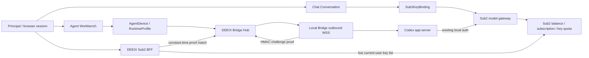
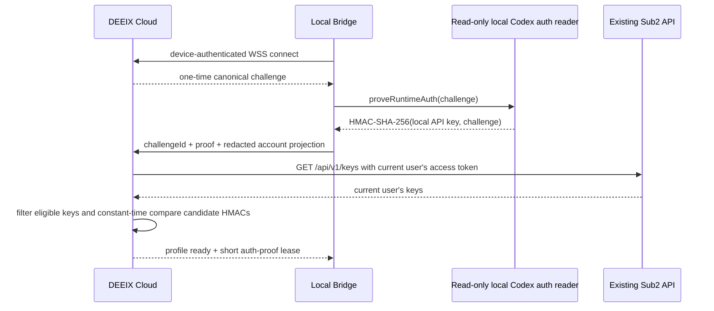

# Clean-slate identity、订阅、Chat key 与本地 Runtime 设计

> 状态：身份与会话基础、订阅页 commerce BFF、设置页默认 Chat key 与管理员模型目录已实现；Work/Bridge/Codex app-server Runtime 仍按本文后续阶段推进。
>
> 本文用于“不保留 DEEIX 本地账号密码、本地套餐、本地余额和本地计费兼容”的重构。
> 它替代 [07-sub2api-account-and-billing.md](./07-sub2api-account-and-billing.md) 中的双 commerce authority 方案；
> Agent/Bridge/app-server 协议仍以 01-05 文档为准。
>
> **硬约束：Sub2API 是只读外部依赖。目标方案只修改 DEEIX Cloud、Web 与本地 Bridge，不增加或修改任何 Sub2API
> route、schema、middleware、token claim 或 gateway 行为。**

## 1. 决策

**保留本地 `Principal`，删除本地商业账户。**

浏览器 session、Conversation、Sub2 key binding、Agent device、workspace、thread、设置和审计都需要一个稳定的本地所有者 ID。
这个 ID 只表示“谁可以访问这些资源”，不保存密码、余额、套餐或支付状态。登录由 DEEIX BFF 调用 Sub2 现有 REST auth API
完成，本地只以 `(sub2_instance_id, sub2_user_id)` 建立或恢复 `Principal`。

**严格 clean-slate gate：** 启动迁移在任何 schema 或数据变更前检查旧本地 identity 数据。旧 `identity_users`、
`identity_sessions` 缺少 Sub2 必需列但含有数据，或待删除的旧 identity 表含有数据时，迁移必须失败。运营方必须先备份现有
PostgreSQL，并使用新的 PostgreSQL database 或 volume；系统没有自动账号映射、email claim、数据迁移或运行时兼容路径，也不保留旧登录或旧 Chat history 连续性。

只有严格单用户、无共享、无多设备隔离的私有实例才可以退化为 instance principal。当前 Web 产品包含多用户会话、
订阅、key 选择和远程 Codex 设备绑定，因此使用隐式全局用户会破坏资源隔离和审计，不作为目标设计。

| 概念 | 权威 | 本地保存 |
| --- | --- | --- |
| 身份认证 | Sub2 现有 REST auth API | `Principal`、session、不可变 `(sub2_instance_id, sub2_user_id)`、加密 token ref |
| 余额、冻结余额、订阅、usage、key 配额 | Sub2API | 页面请求时的脱敏 response；不作授权 |
| Chat 执行资格与扣费 | Sub2 gateway | `Sub2KeyBinding`、Run pin、外部 request ID |
| Codex model 调用资格与扣费 | 本机现有 Codex auth + Sub2 gateway | challenge proof、匹配的 remote key ID、脱敏 account projection |
| Codex 项目、MCP、skills、plugins、thread | 本地 Codex app-server | Agent projection、source refs；auth 与 secret 始终留在本机 |
| Web 资源所有权 | DEEIX | `principal_id` 外键与 ownership check |

## 2. 不要统一的两种“网关”

Sub2 model gateway 和本地 Runtime Bridge 都传递请求，但生命周期与一致性完全不同，不应实现成一个 `Gateway` interface。



`Chat` 是 server-side request/stream/usage 流程；`Work` 是 durable command/event、设备离线、重连和 provider state projection 流程。
二者只共享 `Principal` ownership 和 Sub2 作为上游的事实，不共享 key binding：Chat backend 使用用户在 Web 选择的
`Sub2KeyBinding`；Codex app-server 继续使用用户机器上已经存在的 auth。DEEIX 不给 Agent 下发 Chat key，不读写用户的
`config.toml`，也不让 RuntimeProfile 选择 key。两条链路最终都由 Sub2 实时判定余额、订阅、key quota 和 rate limit，
DEEIX 不做额度预授权。

## 3. 登录与本地 Principal

DEEIX 实现一个只面向固定 Sub2 实例的 BFF，复用当前版本已经存在的 JSON API：

```text
POST /api/v1/auth/register
POST /api/v1/auth/send-verify-code
POST /api/v1/auth/login
POST /api/v1/auth/login/2fa
POST /api/v1/auth/refresh
POST /api/v1/auth/logout
GET  /api/v1/auth/me
```

Web 继续调用当前 DEEIX auth routes；只替换这些 route 后面的 application service，不要求登录/注册页面改路径：

| 现有 DEEIX Web API | BFF 调用的现有 Sub2 API |
| --- | --- |
| `POST /api/v1/auth/login` | `POST /api/v1/auth/login` |
| `POST /api/v1/auth/register/email/start` | `POST /api/v1/auth/send-verify-code` |
| `POST /api/v1/auth/register/email/complete` | `POST /api/v1/auth/register` |
| `GET /api/v1/me` | `GET /api/v1/auth/me` |

DEEIX handler 保留当前 login/registration result 与类型化 error 的页面语义。成功 response 继续返回短时 DEEIX access token，
DEEIX refresh token 继续使用 `HttpOnly` cookie；Sub2 access/refresh token 始终只保存在服务端密文列中，不进入 Browser response、
storage、日志或 trace。现有 `login-page.tsx`、auth form、tabs、input、button、responsive layout、主题和品牌样式全部复用。

`GET /api/v1/me` 继续是 DEEIX composite endpoint：middleware 以本地 session 验证 DEEIX access token，后端再用该 session 的
Sub2 access token调用 `/auth/me`，返回 Principal projection 与 DEEIX-owned settings，不返回 Sub2 bearer。

目标登录流程：

1. Web 从 DEEIX 读取 Sub2 public settings。Browser 向现有 `POST /api/v1/auth/login` 提交 email/password；DEEIX 只在本次
   server-to-server request 中转发，不记录 body、不持久化密码，也不自动重试登录请求。
2. 若 Sub2 返回 `requires_2fa` 与 `temp_token`，DEEIX 使用 `DATA_ENCRYPTION_KEY` 将 temp token 和短时过期时间封装为 opaque
   challenge；Browser 看不到上游 token 明文，提交 TOTP 后由 BFF 调 Sub2 `/auth/login/2fa`。
3. 成功响应必须同时包含 access token、refresh token 和正数 `expires_in`。DEEIX 随即调用 `/auth/me`，只接受 numeric user ID、
   `active` status 以及已知角色；失败时不创建 Principal/session，并 best-effort 登出已取得的上游 refresh token。
4. 本地 natural key 是 `(sha256(canonical SUB2_BASE_URL), Sub2 user.id)`。`SUB2_BASE_URL` 是唯一 Sub2 部署配置，默认值为
   `https://api.ovload.com`；没有可单独
   配置的 `sub2_instance_id`、管理员白名单或 refresh TTL。email、头像与显示名只作 projection。
5. Sub2 `admin` 实时映射为 DEEIX `superadmin`，Sub2 `user` 映射为 DEEIX `user`，未知角色拒绝登录。DEEIX 不创建 bootstrap
   管理员，本地 admin mutation 也不能成为最终身份权威；middleware 从数据库中的最新 Principal 读取角色，不信任旧 JWT role claim。
6. 每个 DEEIX browser session 独立保存自己的 Sub2 access/refresh token 密文和 access expiry，不跨设备共享 token family。
   DEEIX refresh 先校验当前本地 refresh hash，再串行调用 Sub2 `/auth/refresh`，持久化新上游 pair 后轮换本地 token。
7. `/api/v1/me` 每次实时复核 Sub2；其他受保护请求最多使用一分钟的最近复核结果。access 失效时尝试服务端 refresh；Sub2
   身份失效会使本地 session 失效。普通登出先持久化吊销并清除当前本地 session 的 token 密文，再 best-effort 调该 session 的
   Sub2 `/auth/logout`。用户 logout-all 先快照其活跃本地 session，并对快照中的每个 session 执行同一顺序。管理员 session revoke
   只以本地 session 为权威，不声称或尝试安全地撤销未知的上游 session。

BFF 只请求 `SUB2_BASE_URL` 下代码内固定的 allowlisted path，拒绝 Browser 提交 upstream URL。origin 必须是无 credentials、path、
query、fragment 的 HTTP(S) origin，生产环境必须使用 HTTPS；跨 origin redirect 被拒绝，response body 有严格大小上限。

注册页面同样保持现有样式和两步交互：发送验证码时由 DEEIX 转发 `/auth/send-verify-code`，完成注册时转发 `/auth/register`，
并把现有 email、password、verify code、CAPTCHA、promo/invitation/aff 字段按 allowlist 映射。登录成功后的注册 response 走与普通
登录相同的 Principal/session finalization。

首期登录页面承接 Sub2 现有 email/password/CAPTCHA/TOTP JSON contract。前端功能代码仅在 Sub2 开启登录 CAPTCHA 或 TOTP challenge 时补充
状态映射，继续复用现有组件；不新建另一套 auth page。账户页面不包含 WebAuthn、第三方身份、邮箱绑定、注册后的安全设置或本地账户删除控件。
部署前要实测 CAPTCHA domain
allowlist、反向代理可信 IP 和 Sub2 public-settings 字段；这些是部署配置检查，不是 Sub2 源码改动。

必须区分三种凭据：

| 凭据 | 持有者 | 用途 |
| --- | --- | --- |
| DEEIX session cookie | Browser + DEEIX | 访问 DEEIX 页面和资源；不直接调用 Sub2 |
| Sub2 access/refresh token | DEEIX server-side encrypted account store | 读取当前用户 profile、余额、订阅、usage 和 key 列表 |
| Sub2 API key | DEEIX encrypted secret store，仅限被选择的 Chat key | 普通 Chat 模型请求；不下发给 Agent |

所以“DEEIX 调用 Sub2 登录、取得 token、再用 token 请求 Sub2 数据”就是目标流程，但 Browser 只拿 DEEIX session。把 Sub2 bearer
直接交给前端会扩大泄露面并把 DEEIX API 与 Sub2 token 生命周期绑死；把管理 access token 当模型 API key 使用也会混淆 scope。

本地 `Principal` 不保存 password、邮箱验证凭据、TOTP secret/recovery code、余额、套餐或 permission group。已实现的身份 surface 仅为
password 登录/注册、登录时的 TOTP challenge、`/me` projection、Sub2 password-change proxy、DEEIX browser session 和本地 preferences。
禁用用户时只撤销 DEEIX session、Sub2 key binding 和 Agent device 访问；Sub2 账户与本地 Codex runtime 状态仍由各自权威管理。

### 3.1 保留 Account、profile 与 security 页面

保留 `/setting/account`、`/setting/general` 的 profile、password、active-session、timezone、locale 与 conversation preference 组件。
页面不是本地账户域的理由：一个页面可以由多个具体 handler 提供数据。不得删除页面或再造 account UI。

| DEEIX surface | 目标实现 | 固定 Sub2 source evidence |
| --- | --- | --- |
| `GET /api/v1/me`、profile display | Principal/session projection 加 server-side `GET /api/v1/auth/me`；同源 BFF DTO 不含 `subscriptionTier`、本地余额和本地 2FA 权威字段 | DEEIX `backend/internal/transport/http/auth/handler.go` |
| password interaction | password page BFF 到 `PUT /api/v1/me/password`；只映射已验证的 field/DTO，保留现有 validation/error presentation | DEEIX `backend/internal/transport/http/auth/router.go` |
| login TOTP challenge | 仅在 `/api/v1/auth/login` 返回 challenge 后，由 `POST /api/v1/auth/login/2fa` 完成登录；没有账户内的 TOTP 管理界面或 route | DEEIX `backend/internal/transport/http/auth/router.go` |
| account credential controls | 没有本地邮箱绑定、WebAuthn、第三方身份、账户初始化或账户删除 flow | DEEIX `backend/internal/transport/http/auth/router.go` |
| `GET /api/v1/auth/sessions` and session revoke/location UI | DEEIX `principal_sessions` only. These are browser sessions issued by DEEIX, so the current session page/route remains concrete local ownership/security behavior and never becomes a Sub2 credential or admin session | DEEIX `backend/internal/transport/http/auth/router.go` |
| displayName、timezone、locale、appearance/conversation preferences | 保留 DEEIX-owned Principal settings 和 `/api/v1/user/settings`; locally write these fields under Principal ownership, separately from upstream profile mutation | DEEIX `frontend/features/settings/**`, `frontend/shared/api/user-settings.ts` |

`PATCH /api/v1/me` 只写入 DEEIX `displayName`、timezone、locale、appearance/conversation preferences。它不接受
`subscriptionTier`、balance、credential 或任意 upstream profile patch。当前没有本地 email、TOTP、安全验证、身份提供方、账户初始化或账户删除 repository、DTO、handler 或页面流程。

## 4. 订阅、充值与记录页面

保留 `/setting/subscription` 路由以及现有 plan cards、`TopUpDialog`、`RedemptionDialog`、余额、用量图表和记录表的视觉实现。页面仍调用
DEEIX 的 `/api/v1/billing/*`；这些 route 是面向 Web 的 anti-corruption/BFF contract，后端实现改为使用当前 Principal 的 server-side
Sub2 access token 调用固定 Sub2 实例。DEEIX 不再保存或计算套餐、余额、订单、兑换、订阅和金融流水。

进入页面立即读取一次，支付/兑换完成后刷新相关区块，用户也可以手动刷新。不运行定时 sync worker，不写数据库/Redis commerce cache，
也不以本地 snapshot 代替 Sub2 响应。所有读响应带 `observedAt` 并使用 `Cache-Control: no-store`。

### 4.1 现有 DEEIX API 到 Sub2 的映射

| DEEIX Web API | 固定 Sub2 API | 页面用途 |
| --- | --- | --- |
| `GET /api/v1/billing/config` | `GET /api/v1/payment/checkout-info` | 支付方式、限额、开关和帮助信息；支付方式由响应驱动，不硬编码 provider union |
| `GET /api/v1/billing/plans` | `GET /api/v1/payment/plans` | 套餐卡；remote `plan.id` 只作购买引用 |
| `GET /api/v1/billing/account` | `GET /api/v1/user/profile` | 可用余额、冻结余额；fixed profile response 不含币种，不推断或展示 currency |
| `GET /api/v1/billing/overview` | `GET /api/v1/user/profile` + `GET /api/v1/subscriptions/summary` + `/active` + `/progress` | 余额、当前订阅和额度窗口 |
| `GET /api/v1/billing/usage*` | `GET /api/v1/usage` + `/dashboard/stats` + `/dashboard/trend` | 模型调用记录、聚合和趋势 |
| `POST /api/v1/billing/payments/checkout` | `POST /api/v1/payment/orders` | 充值使用 `order_type=balance`；购买套餐使用 `order_type=subscription` 与 `plan_id` |
| `GET /api/v1/billing/orders` | `GET /api/v1/payment/orders/my` | 支付订单分页、状态和筛选 |
| `GET /api/v1/billing/orders/:id` | `GET /api/v1/payment/orders/:id` | 当前用户订单详情 |
| `POST /api/v1/billing/orders/verify` | `POST /api/v1/payment/orders/verify` | 回跳后的订单校验与状态刷新 |
| `POST /api/v1/billing/orders/:id/cancel` | `POST /api/v1/payment/orders/:id/cancel` | 取消当前用户的待支付订单 |
| `POST /api/v1/billing/orders/:id/refund-request` | `POST /api/v1/payment/orders/:id/refund-request` | 对符合条件的余额充值订单发起退款申请 |
| `POST /api/v1/billing/redemptions` | `POST /api/v1/redeem` | 提交 `{ code }` 并刷新余额/订阅 |
| `GET /api/v1/billing/redemptions` | `GET /api/v1/redeem/history` | 兑换记录 |

现有 `frontend/shared/api/billing.ts` 和订阅页组件应优先复用，只调整 DTO 与 data mapping。原先写死的
`PaymentProvider = "stripe" | "epay"` 改为后端返回的受校验 method ID；套餐购买统一走 Sub2 order，不再调用本地 subscribe service。
价格和支付金额在 DEEIX DTO 中使用 decimal string 或 integer minor unit，BFF 仅在 checkout/order response 提供 currency/scale，或部署有明确的 authoritative fixed-unit capability 时校验币种、scale、最小/最大金额与 overflow 后再生成 Sub2 所需 JSON number；`/user/profile` 的 `balance`/`frozen_balance` 没有 currency，不能由价格、locale 或历史订单推断、补造或标注。业务代码不使用二进制浮点执行金额计算。

在当前 DEEIX router 中，`config`、`account`、`overview`、`plans`、`subscriptions`、`payments/checkout`、`redemptions` 和
`usage*` 已存在，应原位替换 handler implementation。表中的 `orders*` 和 `redemptions` history 是 Sub2 已有而 DEEIX 现有 browser
contract 不足以准确表达的新增 BFF reads/mutations；它们只服务现有记录表/filters，不形成 `/me/commerce` aggregate 或本地 snapshot。

### 4.2 支付状态与返回流程

1. Browser 只提交 DEEIX DTO 中的 plan public ref 或充值金额、payment method 和 mobile hint；`order_type`、remote `plan_id`、
   `payment_source` 与 `return_url` 由 BFF 根据操作生成。
2. BFF 把 return URL 固定到 DEEIX 同源订阅页，调用 Sub2 `POST /payment/orders`，裁剪响应后仅返回订单引用、展示字段、支付动作和
   经校验的 HTTPS 跳转地址。
3. Browser 完成支付回到 DEEIX 后，BFF 调 Sub2 `POST /payment/orders/verify` 或读取该用户订单，再刷新余额、订阅和订单记录。
4. 支付 provider webhook、签名校验、订单履约和最终 paid/refunded 状态全部留在 Sub2。DEEIX 不接收 provider webhook，也不自行把订单
   标记为成功。

Sub2 当前创建订单 contract 没有客户端 idempotency key 或 Browser 可提供的 correlation field。DEEIX 用非权威 `sub2_payment_operations` 只保存 operational safety/idempotency evidence：opaque operation ID、`principal_id`、idempotency key/normalized request hash、`prepared|send_started|completed_success|outcome_unknown`、记录时间和 optional returned remote order ID；不保存余额、金额/价格 snapshot、provider/paid 状态、ledger fact 或 upstream response body。transaction 先 claim `(principal_id,idempotency_key)` 并写 `prepared`，同 key/different hash conflict。每个 Principal 串行化，在网络前立即 durable CAS `prepared -> send_started`，每 operation 至多一次 POST。完整成功 response 含 order ID 时 transaction 写 `completed_success`；若已取得 order ID 但完成态写入失败，`outcome_unknown` 保留该 ID，后续 verify read 成功后收敛到 `completed_success`。未取得 order ID 的 crash/timeout/connection loss/非确定 response 不 resend/list-correlate。same-key replay 读取持久状态：`send_started|outcome_unknown` 返回不确定结果，`completed_success` 返回已创建冲突并引导用户刷新 Sub2 订单。另一 Sub2 client 仍可创建同形订单，list/verify reads 只刷新真实 UI，因此该 row 不是 commerce cache 或 authority。查询、校验和页面刷新可按读请求规则重试。

### 4.3 “账单流水”的准确含义

固定 Sub2 版本没有统一 wallet transaction/ledger 用户 API。页面记录区因此按四类真实来源展示：支付订单
`/payment/orders/my`、兑换记录 `/redeem/history`、订阅 `/subscriptions`、模型用量 `/usage`。它们可以共用现有表格样式和筛选器，
但不合成为一条带推算期初/期末余额的权威钱包流水。余额卡始终读取 `/user/profile`；若以后 Sub2 增加统一 ledger route，再只替换
BFF mapping。

现有 usage history 的页面、table/chart shell 与 filters 保留，但每一列必须有 Sub2 事实来源。local `balanceAfter`、local pricing
snapshot/tooltips、由本地模型价格推算的金额或余额变化，在 Sub2 `/usage` 未返回对应事实时省略或隐藏；BFF 不返回零值占位，也不合成本地
计算。该规则同样适用于导出、详情和 tooltip DTO，而不是只在页面上隐藏字段。

这个页面不参与 Chat 或 Agent 授权。即使页面刚显示有余额，每次 Chat 请求和本地 Codex model 请求仍以 Sub2 gateway 当次响应为准；
余额不足、订阅窗口耗尽、key quota/状态异常时直接映射该上游错误并提供刷新/管理入口。

本地 Codex runtime 状态不合并进余额或订阅。它属于 `/agent` 的 profile Account resource，可展示 profile、脱敏 auth mode、
auth-proof 状态、最近上游错误和本地主机信息；设置页可以链接到“运行时连接”，但余额/订阅仍只读 Sub2 commerce API。

## 5. 仅用于 Chat 的 Sub2 key binding

默认密钥只在对话设置页选择，普通对话页不展示密钥控件。Browser 永远不接收或提交 raw key。`Sub2KeyBinding` 是 DEEIX public ID
对该用户 Sub2 remote key 的所有权受检绑定，只供普通 Chat 引用：

```text
Sub2KeyBinding
  public_id
  principal_id
  sub2_account_id
  remote_key_id
  encrypted_key_ref
  label
  masked_key
  group_id
  status
  version
  last_validated_at
```

页面读 Sub2 key 列表时，DEEIX adapter 在服务端解析当前 Sub2 API 的 full-key response，只把 ID、label、mask、group、status、
quota 和 expiry 返回 Browser；未选择的 raw key 不持久化。用户首次选择某 remote key 时，严格 DTO 只提交 remote key ID，服务端
重新读取 Sub2 key list、验证该 key 属于当前 subject 且有效，再将该一把 key 写入 encrypted secret store 并建立 binding。
同一用户/remote key 唯一；同一 raw key 的 keyed fingerprint 在 active binding 中唯一，冲突返回不暴露 owner 的通用错误。

Chat API：

```http
GET    /api/v1/me/sub2-keys
GET    /api/v1/me/sub2-key-bindings
POST   /api/v1/me/sub2-key-bindings
DELETE /api/v1/me/sub2-key-bindings/:binding_id
GET    /api/v1/models
```

设置页和订阅页复用 commerce BFF 对 Sub2 `/keys` 的脱敏读取；已绑定项带 opaque `bindingId`，未绑定项只有 remote key metadata。
`POST /api/v1/me/sub2-key-bindings` 的 DTO 是 `{ "remoteKeyID": 123 }`，使用 `Idempotency-Key`。Browser 只持久化该 opaque DEEIX
binding ID；默认值写入 DEEIX 用户设置 `chat.default_sub2_key_binding_id`，encrypted key material 仅保存在服务端。`GET /api/v1/models`
独立返回当前用户有权访问的 DEEIX 管理员发布目录及展示分组，不调用 Sub2 `/v1/models`，也不以 key 或套餐推导模型目录。

DEEIX 用户设置保存 `chat.default_sub2_key_binding_id`；普通对话发送时静默读取该默认 binding。每个 Run 在任何 route/network 前固定：

普通文本对话不保存用户协议偏好。DEEIX 根据管理员为模型发布的协议与默认 API key 所属分组解析实际请求协议；两者没有交集时，
该模型不会出现在当前 key 的模型列表中，后端也会重复校验。模型能力配置按解析后的协议过滤字段和原生工具，例如 Responses
使用 `reasoning.effort`、`reasoning.summary` 与 `text.verbosity`，Anthropic Messages 使用对应的 Messages 字段。

```text
principal_id
sub2_key_binding_id
sub2_key_binding_version
remote_key_id
requested_model
resolved_model
external_request_id
known_token_usage
```

在设置页切换 key 或 rotate 只影响新 Run。Run 开始时 binding 不属于当前 principal、状态失效、remote key 不可用或请求模型不在
DEEIX 管理员目录/权限范围时 fail closed；不改用另一把 key。Conversation service 从 secret store 解析 key，直接以 deployment-fixed
Sub2 base URL 请求模型端点。
不调用本地 `AuthorizeUsage`，不写本地金融 ledger；Sub2 返回的额度错误是执行结果。

## 6. 本地连接的 Codex Runtime

远程 Web 控制本地 Codex 时，本地 Bridge 主动建立到 DEEIX 的 WSS，不要求公网入站访问用户机器。绑定流程继续使用
01-05 文档定义的 enrollment code、device public key、challenge、短时 connection token 和 durable Bridge WAL。

资源关系：

```text
Principal
  -> AgentDevice (一台本地机器/Bridge)
      -> RuntimeProfile (一个 Codex app-server 实例和账号状态)
          -> Workspace
          -> AgentThread
              -> AgentTurn / Item / Interaction / Event
```

`AgentDevice.user_id` 在 clean-slate schema 中改名为 `principal_id`。Browser 只提交 opaque device/profile/workspace/thread refs；
Bridge 在本机将它们解析为 raw app-server ID 和 canonical cwd。Codex access token、ChatGPT cookie、MCP secret、local path 和
插件 credential 留在本机 secret store/app-server，Cloud 只保存 redacted capability/account projection。

### 6.1 硬边界

- Sub2 key selector 只存在于普通对话设置页；`/chat` composer 与 `/agent` 都不展示该控件。
- DEEIX 不创建或修改用户机器上的 `config.toml`、auth 文件、环境变量或系统 keychain。
- Cloud 不向 Bridge 下发 Sub2 account token、Chat API key、gateway URL 或 provider config。
- Bridge 只使用本地客户端/app-server 已经拥有的 auth；auth 不存在、过期或未匹配当前用户的 Sub2 key list 时，RuntimeProfile 不进入 `ready`。

Work composer 继续根据 RuntimeProfile capability manifest 生成 model、effort、permission、collaboration、MCP 和 skill 控件。模型列表、
项目、thread、MCP、skills 和 plugins 都从本地 app-server projection 得到，而不是从 Chat key binding 推导。

### 6.2 为什么 `account/read` 不能单独作为准入证明

Codex [App Server auth contract](https://developers.openai.com/codex/app-server#auth-endpoints) 提供 `account/read`、
`account/login/start`、`account/logout` 和 `account/updated`。对 API key 模式，`account/read` 只返回
`{ "account": { "type": "apiKey" } }`；它不返回 API key、Sub2 instance 或实际 gateway 归属。因此 `authMode`、email、
provider label、base URL 和设备自报 `isOurs` 都只能作 UI projection，不能授权 RuntimeProfile。first release 的 Agent policy 仅投影 read-only account/status/rate-limit/config/skills/hooks/MCP diagnostics；`account/login/*`、`account/logout`、token refresh、config/skill/MCP OAuth or credential mutation 都是 manifest-disabled，Browser 不创建对应 AgentCommand。

### 6.3 只改 DEEIX 的 HMAC proof-of-possession

当前 Sub2 `/api/v1/keys` 会向已登录用户返回其 raw API keys。DEEIX 已经持有该用户的 Sub2 access token，因此可以利用现有
contract 验证本地 key 的**持有证明**，而不让 Bridge 上传 key 原文：



Canonical challenge 使用固定编码，不拼接含糊 JSON：

```text
deeix-runtime-auth-proof-v1
principal_public_id
device_public_id
profile_public_id
device_public_key_thumbprint
nonce_base64url
expires_at_unix
```

各字段按上述顺序以 UTF-8 编码并用单个 LF 分隔，不添加尾随 LF；ID、thumbprint 和 nonce 均使用已校验的 canonical form。

`nonce` 至少 256 bit，challenge 60 秒过期且只消费一次。Bridge 的现有 `ProviderAdapter` 增加
`proveRuntimeAuth(challenge) -> proof`；Codex 实现通过版本固定的只读 auth reader 在内存中取得现有 API key并计算 HMAC，
返回 base64url proof 后立即释放引用。它不创建或修改 `config.toml`、auth 文件、环境变量或 keychain，也不把 key 暴露给
Browser、WSS payload 或普通 ProviderCommand。

Cloud 收到 proof 后，使用当前 Principal 的 Sub2 access token实时读取 `/api/v1/keys`，只保留 `active`、未过期且属于该用户的
候选项。对每个候选 raw key 计算相同 HMAC，使用常量时间比较并要求恰好一个匹配；随后立即丢弃 response 中的所有 raw keys，
只保存 matched `remote_key_id`、server-keyed credential fingerprint、challenge hash、验证时间和短时 lease expiry。proof 自身不落库。
这同时证明本地持有的 key 出现在**当前登录用户、当前固定 Sub2 instance** 的 key 集合中；另一个 Sub2 实例或另一用户的 key
不会匹配。

该方案依赖本地 DEEIX 客户端能以只读方式取得 Codex 当前 API key。stock app-server 的 `account/read` 不暴露 key，所以实现点在
DEEIX Local Bridge 的版本固定 Codex auth reader，而不是新建 Sub2 endpoint。若本地 auth mode 不是 API key、读取失败或 key
不在当前用户列表中，profile 状态进入 `auth_unsupported`、`auth_unreadable` 或 `auth_mismatch`，不进入执行态。

App Server 的 `attestation/generate` 继续保持 lock 中的 `disabled` disposition：现有 Sub2 并不验证
`x-oai-attestation`，启用该 header 对此准入没有作用。

### 6.4 生命周期

RuntimeProfile 状态为 `unverified -> proving -> ready -> expired/revoked/mismatch`。首次绑定、Bridge 重连、`account/updated`、
本地 auth rotation 以及 proof lease 到期前都重新 challenge。证明失败后停止派发新 command；已接受 turn 由 app-server 最终事件
收敛，历史 projection 仍可读。Sub2 余额、key quota 和实际 key 可用性仍由每次本地模型请求的 gateway response 决定。

为了发送 challenge，WSS 先建立一个只有 `auth.prove`、`disconnect`、`heartbeat` 的隔离通道；proof 通过前不注册 ready runtime、
不接受 workspace/thread projection，也不派发执行命令。proof 尝试按 device/principal/IP 限速，连续 mismatch 使 enrollment
进入冷却。以后增加 Claude runtime 时，只给已有 `ProviderAdapter` 增加对应 `proveRuntimeAuth` 实现；Cloud proof envelope
保持 provider-neutral，普通 Chat 的 Sub2 execution 不知道 Codex 或 Claude。

## 7. 最小持久模型

clean-slate commerce 侧需要以下事实；不是为“多 provider”预建框架：

| 表 | 责任与关键约束 |
| --- | --- |
| `principals`（当前复用 `identity_users`） | `id/public_id`、immutable `sub2_instance_id/sub2_user_id`、display projection、由实时 Sub2 role 映射的 `user/superadmin`、status；unique `(sub2_instance_id, sub2_user_id)`。 |
| `principal_sessions`（当前复用 `identity_sessions`） | DEEIX refresh hash、principal、expiry/revocation，以及该 browser session 独占的 encrypted Sub2 access/refresh token、access expiry 和最近身份复核时间。 |
| `sub2_key_bindings` | **Chat only**；public ID、principal/account、remote key ID、encrypted key ref、keyed fingerprint、mask/meta、status/version；unique `(principal_id, remote_key_id)`，active fingerprint unique。 |
| `sub2_payment_operations` | create-order 的非权威 safety/idempotency evidence：opaque operation ID、principal、idempotency key/hash、`prepared/send_started/completed_success/outcome_unknown`、记录时间和 optional remote order ID；无金额、余额、provider/paid/ledger 或 response body。 |
| `identity_operations` | token rotation、Chat key binding 的 claim/hash/result/ref/lease/retry。 |
| `agent_runtime_auth_proofs` | challenge hash、device/profile/principal、matched remote key ID、credential fingerprint、issued/expiry/verified/revoked 时间与结果；challenge hash 唯一，不保存 proof 或 raw key。 |

Conversation/Run、Agent 表继续存在，但所有 ownership 外键统一为 `principal_id`。不要同时保留 `user_id` 与 `principal_id` 两套
概念。已有 `agent_devices`、`agent_runtime_profiles`、`agent_workspaces`、`agent_threads`、commands/events/WAL 合同继续承担 Runtime
状态，commerce 表不保存 device/profile/thread 字段。

`conversation_runs` 增加 `sub2_key_binding_id`、`sub2_key_binding_version`、`remote_key_id` 和 `external_request_id`。
`agent_runtime_profiles` 增加 `auth_status`、`auth_mode`、`matched_remote_key_id`、`credential_fingerprint`、
`auth_proof_expires_at` 和 `last_auth_proof_id`；不含 `sub2_key_binding_id`、gateway URL 或 credential ref。
`agent_turns` 可保存开始时的 `runtime_auth_proof_id` 作审计，不保存 auth/key。proof 到期、撤销或 mismatch 只影响新 turn，
不改写历史 Run/Turn。

## 8. 服务端模块边界

使用具体模块，不先创建单实现的通用 commerce provider framework：

```text
application/principal     session 与 ownership
application/sub2account   REST login/2FA、account live read、token refresh/logout
application/sub2commerce  套餐、余额、订单、兑换、订阅与 usage 的 BFF mapping
application/sub2key       Chat remote key metadata 与 binding
application/conversation  Run pin、model eligibility、stream
application/agent         device/profile/thread/command projection 与 HMAC proof verification

infrastructure/sub2       具体 auth、management 与 Chat gateway HTTP client
infrastructure/secret     token/secret envelope encryption
infrastructure/bridge     WSS Hub、cursor、dispatcher
```

`conversation` 通过一个窄的具体 Sub2 execution service 解析 binding secret 并执行模型请求；不要让 HTTP handler 读取 token、拼接
Sub2 URL 或访问 commerce response JSON。`agent` 通过具体 Sub2 account client 在 proof 时读取当前 remote keys、常量时间验证、维护
profile 状态并调度 device command；它不读取 Chat `sub2_key_bindings`，不复用 Chat stream client，也不提供 credential endpoint。
共享 package 只放 `PrincipalID`、clock、ID、idempotency、audit 等真正公共的基础类型，不放 `Gateway`, `Account`, `Model`
这类含义不同的巨型 interface。

## 9. 前端状态与交互

| 页面 | 数据源 | 选择状态 |
| --- | --- | --- |
| `/setting/subscription` | `/billing/*` BFF -> Sub2 profile/payment/redeem/subscriptions/usage | 套餐购买、余额充值、兑换、订单/兑换/用量记录；通过既有页面刷新/重载控件手动刷新；无 local commerce mutation |
| `/chat` | DEEIX 管理员发布的模型目录 + 服务端默认 Sub2 key binding | 对话页只选择管理员发布为 `chat` 且协议与当前 key 分组匹配的模型与展示分组；默认 key 仅在对话设置中选择，发送时静默使用；Run 固定实际 model/binding/version/protocol。协议由管理员模型配置和 key 分组共同解析，用户不配置协议。 |
| `/agent` | Agent device/profile/workspace + app-server projection | 无 key selector；turn UI 选择 runtime/model/permission |
| `/setting/account` | `GET /api/v1/me` composite、`/api/v1/auth/sessions`、Sub2 password-change BFF route | Principal projection、DEEIX browser sessions 和 password change |
| `/setting/general` and chat preferences | DEEIX Principal/user-settings routes | displayName/avatar/timezone/locale/appearance/notification/conversation preferences；Sub2 profile 仅可在新 Principal 创建时提供初始投影，不进行写回 |
| Runtime connections | Agent device APIs | pairing、revoke、online/schema/auth-proof status；不提供 auth 编辑 |

Sub2 key 加载失败时保留设置页的 disabled/error 状态，不静默切 key。对话页不展示 key selector，模型目录也不依赖 key；
模型名称、展示分组、能力和可见范围由 DEEIX 管理员目录决定。运行中的 stream 使用 Run pin，不响应另一个 tab 的默认 key 或模型变化。

Agent device 离线时历史 projection 仍可读，新 command 显示 `waiting_for_device`。auth 未证明时显示 `auth_verification_required`，
只提供“重新校验”命令，不展示 key 输入框或 config 编辑器。不要把设备离线或 auth-proof failure 当作 Chat upstream failure，
也不要尝试用 Sub2 Chat 完成同一个 Agent turn。

## 10. 删除范围

既然不考虑兼容，目标实现删除以下本地权威实现，而不是删除用户入口：

- DEEIX `Plan`、`Price`、`Subscription`、`PaymentOrder`、`BillingAccount`、`BalanceTransaction`、
  `UsageBalanceReservation`、`UsageLedger`、`Redemption` 和本地模型价格；
- `/api/v1/billing/*` 背后的 local repository/service、admin local billing、local checkout/top-up/redeem/subscribe 实现；这些 Web routes
  保留为具体 Sub2 commerce BFF；
- 本地套餐/支付配置管理界面与本地钱包流水语义；现有 plan cards、支付/充值/兑换 dialogs、余额、订阅、用量和记录 UI 保留并改接 BFF；
- 从本地套餐推导 Chat 模型资格的逻辑，以及按 key 调用 Sub2 `/v1/models` 的目录路径；模型资格只由 DEEIX 管理员发布目录与权限组决定；
- `User.subscriptionTier`、本地余额、password/2FA/email verification 等本地账户字段和流程；只保留经验证的 Sub2 BFF mapping 与 DEEIX browser-session security。
- local TOTP recovery-code issue/regenerate DTO/backend branches，以及 usage 的 `balanceAfter`、local pricing snapshot/tooltips 和本地推算金额；保留 UI shell 时只显示有 Sub2 事实的字段。

保留 Conversation/Message/Run 内容历史、文件/RAG、Chat UI、Agent 全套 projection、admin model presentation allowlist，以及订阅页的
套餐购买、充值、兑换、余额、订阅、订单/兑换/用量记录入口。保留 DEEIX admin 的 Principal/session/Agent ownership views，但删除
本地 balance/plan/payment configuration、refund、redemption-code、password/2FA reset 等管理 mutation。Sub2 的套餐与支付管理仍在
Sub2 admin；DEEIX 管理端只提供跳转或只读状态，不持有 Sub2 admin credential，也不代理 Sub2 admin mutation。
历史金融数据若无需兼容，仅做一次离线归档后删除，不在运行时代码保留双读。

## 11. 必须保持的安全与恢复规则

- 所有 Browser public ID 都先做 principal ownership 校验；remote key ID 不能作为 ownership 证明。
- 登录 password、CAPTCHA proof 和 TOTP 只存在于当前请求内，不进日志、DB、Redis、trace、idempotency payload 或 retry queue。
- Sub2 2FA temp token 只以短时加密 challenge 进入 Browser；Sub2 access/refresh pair 只在 `/auth/me` active/role 复核后写入 session 密文列。
- Browser unsafe request 继续使用短时 DEEIX Bearer access token；refresh cookie 为 `HttpOnly`、`Secure`（生产）和 `SameSite=Lax`，Sub2 bearer 从不进入 Browser。
- Sub2 account access/refresh token 与被选择的 Chat API key 仅 server-side encrypted storage；三者均不进入 Browser、Bridge、WSS 或日志。
- refresh 在 Full 单应用进程中串行化，且只接受 session 当前 DEEIX refresh hash；旧 hash 不触发 Sub2 refresh。远端轮换成功但本地持久化失败时保留 fail-closed 行为并要求重新登录，不重试已消费的旧 Sub2 refresh token。
- commerce live response 只展示，不授权；Chat 每次由 Sub2 gateway 校验所选 key，本地 Codex 每次由 Sub2 校验其现有本地 auth。
- 套餐、支付方式、限额、余额和订单状态只信任 Sub2 实时响应；DEEIX 不缓存支付授权结论，不接 provider webhook，不代替 Sub2 履约。
- checkout 只接受 allowlisted operation/method、有效 plan ref 或通过 decimal 校验的充值金额；return URL 固定同源，支付跳转只允许校验后的 HTTPS URL。
- 创建订单不做透明网络重试；所有订单查询、取消、退款申请和校验都绑定当前 Principal 的 Sub2 access token，Browser remote ID 不作 ownership 证明。
- create-order 使用 `sub2_payment_operations` 的 durable `prepared -> send_started` boundary；仅完整成功 response 的 returned order ID 关联，`send_started` 后的不确定结果不重放也不从订单列表绑定；该 row 不是 commerce cache/authority。
- 普通 logout 仅处理当前 session；用户 logout-all 先快照活跃 session，并对每个快照 session 先完成本地吊销与 token 密文清理，再 best-effort 调对应的 Sub2 `/auth/logout`。管理员 session revoke 是本地权威操作，不宣称或执行上游 logout；只有 `SUB2_BASE_URL` 一个 Sub2 部署参数。
- Chat key binding create/delete 使用 `Idempotency-Key` 和 durable operation；runtime auth proof 使用一次性 nonce、canonical encoding、device/profile binding、expiry 和 HMAC 防重放。
- proof verifier 每次从 Sub2 实时读取当前用户 keys，常量时间比较后立即丢弃 raw keys/proof；DB 只存 matched remote key ID 与 keyed fingerprint。
- Run 先持久化 binding/version/model pin，再解析 key 并调用 Sub2；AgentTurn 记录有效 runtime auth-proof ref；外部 request ID 用于结果关联。
- Sub2 outage 会使 Chat 与本地 Codex 的新 model call 失败；不影响本地历史、Agent history、Bridge control connection 或订阅页之外的读取。
- Bridge/app-server outage 只影响 Work command；不影响订阅页面和普通 Chat。
- 日志、event、commerce response、Browser cache 和 WSS command 均不得包含 Sub2 token/raw key 或本地 Codex credential。
- `account/read`、email、auth mode、provider label 与设备自报 gateway URL 都不是信任依据；只有匹配当前 Principal 实时 Sub2 key list 且未过期的 HMAC proof 可使 profile `ready`。

Chat Sub2 client 与 Bridge Codex mapper 输出同一组**展示分类**，但保留各自 transport/provider 原始状态用于脱敏审计：

| 分类 | 执行结果 |
| --- | --- |
| `sub2.insufficient_balance` | 当前 Run/Turn 失败，显示余额入口；不换 key |
| `sub2.subscription_exhausted` | 当前 Run/Turn 失败，显示订阅窗口与刷新入口 |
| `sub2.key_disabled` / `sub2.key_quota_exceeded` | Chat 标记 binding 需检查；Agent 标记本地 auth 需检查；新执行仍以 Sub2 实时结果为准 |
| `sub2.rate_limited` | 使用 Sub2 `Retry-After`；不在 DEEIX 制造另一套额度 |
| `sub2.unavailable` | 当前调用失败，可重试同一用户意图；不切到其他 upstream |

普通 Chat 保存 Sub2 HTTP status、sanitized upstream code 和 external request ID。Agent 保存 app-server/ProviderAdapter 映射后的同类
code、source request ref 与 auth-proof ref，不保存 Chat binding；两者都不把余额不足伪装成 Bridge 离线或本地 billing error。

## 12. 实施顺序与验收

### Phase 1 - identity foundation（已落地）

已实现固定 Sub2 REST client、login/2FA、注册验证码/complete、refresh/logout/me/password change、Sub2 subject 唯一映射、per-session token 密文、
实时 role/status 复核以及 `SUB2_BASE_URL` 的 origin/HTTPS/redirect 校验。登录/注册保留原有视觉结构，但删除 DEEIX 本地密码重置、邮箱变更、
TOTP 设置、OAuth/provider binding、账户删除和初始安全引导。账户页只保留 Sub2 投影、改密和 DEEIX session 管理；管理端用户页只读展示
Sub2 投影并可吊销 DEEIX session。生产装配不再执行 bootstrap superadmin；目标 schema 不包含 identity provider/credential/MFA/
verification/trusted-device 表或 `identity_users` 上的旧身份列。验收覆盖 client request/response、跨 origin redirect、配置校验、角色映射、
2FA challenge 加密、旧路由不可达、旧表清理和现有 session 回归。

### Phase 1B - account 与 commerce BFF

把现有订阅页面与 `/billing/*` handlers 改接 Sub2 profile/payment/redeem/subscriptions/usage API。保留 `/setting/account`、
`/setting/general`、`/setting/subscription` 的现有页面结构：账户标识保持只读，DEEIX-owned 昵称、头像、时区和对话偏好继续写本地
Principal 投影；不重新引入本地 TOTP、邮箱、provider 或密码重置控制，也不创建第二套页面。

验收：动态 payment method、profile balance 无 currency 展示、balance/subscription/order mapping、checkout return/verify、兑换后刷新、
订单/兑换/订阅/用量记录、Sub2 read/write failure、password/token redaction 以及订阅页视觉回归。Payment fixture 证明 possibly-sent
create-order 不重放，也不从列表猜测绑定 remote order。

`sub2_payment_operations` checks cover same-key completed replay, same-key/different-hash conflict and post-send unknown replay；所有 post-boundary 情况都不执行第二次 POST 或订单列表猜测绑定。

### Phase 2 - Sub2 key binding 与 Chat 执行

实现 server-side Sub2 key list sanitization、设置页默认 key 的 encrypted binding、DEEIX 管理员模型目录和 Run pin。验收：
未选择 key 不落库、raw key 不出 Browser、对话页无 key selector、模型与展示分组不请求 Sub2 `/v1/models`、不同用户同 key fingerprint conflict、
并发 rotate、Run 中途默认 key 变化不漂移、Sub2 额度/key 错误原样归类且无本地回退、无本地 billing 调用。

### Phase 3 - clean deletion

删除本地 billing repository/service/config/migration runtime 路径，统一 `principal_id`，移除 local permission-derived Chat eligibility。
验收：repository 无 local financial domain、financial tables 或 local settlement 引用；`/billing/*` 只依赖具体 Sub2 commerce client；
订阅/充值/兑换/记录、Chat/Agent/account/session/RAG 回归通过。

### Phase 4 - Runtime integration

按 01-05 文档实现 Agent device enrollment、Bridge WSS、Codex adapter、projection 和 `/agent` UI；在现有 ProviderAdapter 增加
`proveRuntimeAuth`，在 Cloud 增加 HMAC challenge verifier/state，并保持 `attestation/generate` disabled。
验收：同一 Principal 可绑定多设备，设备/工作区/thread 不越权；伪造 `account/read`、另一用户/另一实例 key、过期 challenge、nonce
重放、错误 device key、多个/零个 HMAC match 全部拒绝；candidate raw keys 与 proof 不落库/日志；Browser/WSS 无 raw auth；整个流程
不创建或修改 `config.toml`、auth 或 Sub2 代码；重新证明不打断已接受 turn；Codex 请求实际到达 Sub2，额度错误沿 app-server event
返回，Chat 与 Work 故障互不影响。

最终端到端场景：用户以 Sub2 登录，在订阅页查看 Sub2 套餐/余额/订阅、购买套餐、充值、兑换并查看订单/兑换/用量记录；页面进入、
每次操作完成或手动刷新时读取 Sub2 最新状态。在对话设置中选择一条 opaque 默认 `Sub2KeyBinding`，在 Chat 仅选择 DEEIX 管理员发布的
模型与展示分组，发送时静默使用默认 binding 并由 Sub2 实时扣费；在 Work 连接已经配置并已有 auth 的本地 Codex app-server，Bridge 对 challenge
生成 HMAC proof，Cloud 用当前 Principal 的实时 Sub2 key list 匹配后才执行 thread。Chat key、Sub2 account token 与本地 Codex auth 三者互不复用；系统
共享 Principal ownership，但不复制余额，也不混合 Chat/Agent 执行状态。

## 13. 源码核对结论

固定阅读基线：DEEIX `026c87718576526fb111c947e240d7db3897ced7`，Sub2API
`48eb3766d2da817b171b45bb3036d42575e42b8f`。

| 结论 | 源码依据 | 目标处理 |
| --- | --- | --- |
| DEEIX 现有本地登录、2FA、密码、provider login/session 是完整本地账户域 | DEEIX `backend/internal/transport/http/auth/router.go`、`backend/internal/application/auth/service.go` | clean-slate 删除本地 credential 流程，只保留 Principal、session 与 ownership |
| DEEIX profile/general/account 页面混合 identity、session、displayName、timezone 和 conversation preferences | DEEIX `frontend/app/(project)/setting/{account,general}/page.tsx`、`frontend/shared/api/auth.ts`、`frontend/shared/api/user-settings.ts` | 保留页面和 components；displayName/avatar/timezone/locale/appearance/notification/conversation preferences 都由 DEEIX Principal/session/preferences handlers 本地管理，已有值在 Sub2 复核时保留 |
| DEEIX active-session UI 管理自己的 browser session | DEEIX `backend/internal/transport/http/auth/router.go`: `/auth/sessions*` | `principal_sessions` 继续支持现有 session list/revoke/location interaction；它不代表 Sub2 credential/session |
| DEEIX provider token DTO 目前只有 access token/token type/id token，不保留 refresh/expiry/scope | DEEIX `backend/internal/application/auth/provider.go` 的 `oauthTokenResponse` | 不复用 provider bridge；实现专用 Sub2 REST auth BFF 与 encrypted token store |
| Sub2 当前 `/auth/login` 会签发 access/refresh token，并处理 CAPTCHA 与可选 2FA | Sub2API `backend/internal/server/routes/auth.go`、`backend/internal/handler/auth_handler.go` | DEEIX BFF 直接适配现有 login/2FA/refresh/logout/me contract |
| Sub2 logout suppresses `RevokeRefreshToken` errors and always returns HTTP 200；auth response 只给 access `expires_in` | Sub2API `backend/internal/handler/auth_handler.go:724-740`、`backend/internal/service/auth_service.go:1669-1704` | 每个 DEEIX session 独占一个 Sub2 token pair；本地吊销先提交，`/auth/logout` 仅 best-effort，不增加 refresh TTL 配置 |
| Sub2 的 profile、keys、subscriptions、usage 已有 JWT 用户路由 | Sub2API `backend/internal/server/routes/user.go` | DEEIX BFF 使用 server-side Sub2 access token 实时读取并脱敏 |
| Sub2 已有 user password route | Sub2API `backend/internal/server/routes/user.go`: `/user/password` | 当前 DEEIX 只代理 password change；其他账户凭据与安全控制不在本地身份域 |
| Sub2 `UpdateProfileRequest` 不含 DEEIX displayName/timezone/conversation preferences | Sub2API `backend/internal/handler/user_handler.go` | 保留 general UI；DEEIX-owned 昵称、头像、时区和对话偏好继续归 Principal，账户 email/username 只读投影 |
| Sub2 已有 checkout info、套餐、创建/校验/查询/取消订单与退款申请用户路由 | Sub2API `backend/internal/server/routes/payment.go`、`backend/internal/handler/payment_handler.go` | 保留 DEEIX 支付 UI；`/billing/*` BFF 映射到 Sub2，webhook 与履约留在 Sub2 |
| Sub2 `/user/profile` 提供 `balance` 与 `frozen_balance`，但 fixed response 没有 currency | Sub2API `backend/internal/handler/dto/types.go`、`backend/internal/handler/user_handler.go` | billing account 不推断或展示余额 currency；只有 checkout/order 明示，或部署提供 authoritative fixed-unit capability 时才处理币种/scale |
| Sub2 `/payment/orders/my` 没有 client correlation/idempotency field，且另一 Sub2 client 可产生同形订单 | Sub2API `backend/internal/handler/payment_handler.go`、`backend/internal/service/payment_order.go` | Principal serialization 只限 DEEIX in-flight create；complete successful POST response 才关联，任何 possibly-sent missing/ambiguous response 是 `outcome_unknown`，不重放或从 list bind |
| Sub2 已有兑换与兑换历史路由，但没有统一用户 wallet ledger route | Sub2API `backend/internal/server/routes/user.go` | 保留兑换 UI；记录区分开显示订单、兑换、订阅和 usage，不推算本地钱包流水 |
| Sub2 当前用户 key DTO/list 会返回 raw `key` | Sub2API `backend/internal/handler/dto/types.go`、`mappers.go`、`api_key_handler.go` | adapter 严格裁剪；只在 Chat 首次选择时加密保存选中 key |
| Sub2 gateway 已有 API-key auth 的 `/models`、`/responses`、`/sub2api/billing` | Sub2API `backend/internal/server/routes/gateway.go` | Chat 与本地 Codex 复用现有 gateway；不增加 Sub2 route |
| app-server `account/read` 对 API key 只证明 auth mode，不证明 instance/owner | 官方 App Server auth contract；本地 `02-codex-app-server.md` | 只作 projection；RuntimeProfile 准入使用 local HMAC proof + live `/keys` match |
| app-server 的 upstream attestation 需要上游配合验证 | 官方 App Server attestation contract；本地 lock 中 `attestation/generate` 为 `disabled` | 现有 Sub2不消费该协议，保持 disabled |

因此不存在需要保留的旧兼容层：身份、commerce、Chat execution、Agent control 是四个具体模块；共享 `PrincipalID` 和少量基础类型，
不共享 token、key、HTTP client 或含糊的 `Gateway` interface。所有新 route、表、状态机和验证逻辑都位于 DEEIX；Sub2 保持固定版本。
