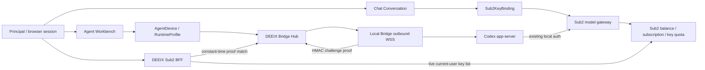
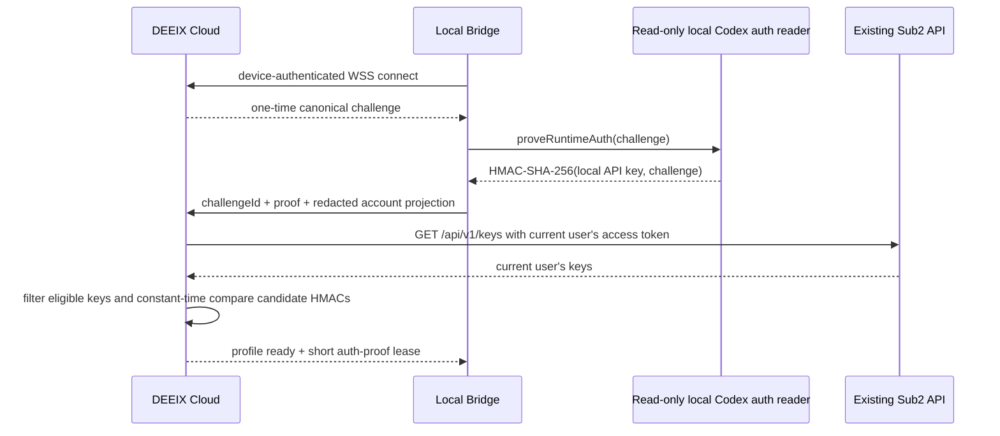

# Clean-slate identity、订阅、Chat key 与本地 Runtime 设计

> 状态：目标设计，尚未实现。
>
> 本文用于“不保留 DEEIX 本地账号密码、本地套餐、本地余额和本地计费兼容”的重构。
> 它替代 [07-sub2api-account-and-billing.md](./07-sub2api-account-and-billing.md) 中的双 commerce authority 方案；
> Agent/Bridge/app-server 协议仍以 01-05 文档为准。
>
> **硬约束：Sub2API 是只读外部依赖。目标方案只修改 DEEIX Cloud、Web 与本地 Bridge，不增加或修改任何 Sub2API
> route、schema、middleware、token claim 或 gateway 行为。**

## 1. 决策

**保留本地 `Principal`，删除本地商业账户。**

浏览器 session、Conversation、Sub2 key binding、Agent device、workspace、thread、设置和审计都需要一个稳定的本地所有者 ID。
这个 ID 只表示“谁可以访问这些资源”，不保存密码、余额、套餐或支付状态。登录由 DEEIX BFF 调用 Sub2 现有 REST auth API
完成，本地只以 `(sub2_instance_id, sub2_user_id)` 建立或恢复 `Principal`。

只有严格单用户、无共享、无多设备隔离的私有实例才可以退化为 instance principal。当前 Web 产品包含多用户会话、
订阅、key 选择和远程 Codex 设备绑定，因此使用隐式全局用户会破坏资源隔离和审计，不作为目标设计。

| 概念 | 权威 | 本地保存 |
| --- | --- | --- |
| 身份认证 | Sub2 现有 REST auth API | `Principal`、session、不可变 `(sub2_instance_id, sub2_user_id)`、加密 token ref |
| 余额、冻结余额、订阅、usage、key 配额 | Sub2API | 页面请求时的脱敏 response；不作授权 |
| Chat 执行资格与扣费 | Sub2 gateway | `Sub2KeyBinding`、Run pin、外部 request ID |
| Codex model 调用资格与扣费 | 本机现有 Codex auth + Sub2 gateway | challenge proof、匹配的 remote key ID、脱敏 account projection |
| Codex 项目、MCP、skills、plugins、thread | 本地 Codex app-server | Agent projection、source refs；auth 与 secret 始终留在本机 |
| Web 资源所有权 | DEEIX | `principal_id` 外键与 ownership check |

## 2. 不要统一的两种“网关”

Sub2 model gateway 和本地 Runtime Bridge 都传递请求，但生命周期与一致性完全不同，不应实现成一个 `Gateway` interface。



`Chat` 是 server-side request/stream/usage 流程；`Work` 是 durable command/event、设备离线、重连和 provider state projection 流程。
二者只共享 `Principal` ownership 和 Sub2 作为上游的事实，不共享 key binding：Chat backend 使用用户在 Web 选择的
`Sub2KeyBinding`；Codex app-server 继续使用用户机器上已经存在的 auth。DEEIX 不给 Agent 下发 Chat key，不读写用户的
`config.toml`，也不让 RuntimeProfile 选择 key。两条链路最终都由 Sub2 实时判定余额、订阅、key quota 和 rate limit，
DEEIX 不做额度预授权。

## 3. 登录与本地 Principal

DEEIX 实现一个只面向固定 Sub2 实例的 BFF，复用当前版本已经存在的 JSON API：

```text
POST /api/v1/auth/register
POST /api/v1/auth/send-verify-code
POST /api/v1/auth/login
POST /api/v1/auth/login/2fa
POST /api/v1/auth/refresh
POST /api/v1/auth/logout
POST /api/v1/auth/forgot-password
POST /api/v1/auth/reset-password
GET  /api/v1/auth/me
```

Web 继续调用当前 DEEIX auth routes；只替换这些 route 后面的 application service，不要求登录/注册页面改路径：

| 现有 DEEIX Web API | BFF 调用的现有 Sub2 API |
| --- | --- |
| `POST /api/v1/auth/login` | `POST /api/v1/auth/login` |
| `POST /api/v1/auth/register/email/start` | `POST /api/v1/auth/send-verify-code` |
| `POST /api/v1/auth/register/email/complete` | `POST /api/v1/auth/register` |
| `POST /api/v1/auth/password/reset/start` | `POST /api/v1/auth/forgot-password` |
| `POST /api/v1/auth/password/reset/complete` | `POST /api/v1/auth/reset-password` |
| `GET /api/v1/me` | `GET /api/v1/auth/me` + `GET /api/v1/user/profile` |

DEEIX handler 保留当前 login/registration/password-reset result 与类型化 error 的页面语义，但 `LoginData` 的 browser bearer
fields 必须改为 session-safe completion/user projection：成功 response 只配合 `Set-Cookie` 建立 DEEIX session，绝不包含 Sub2 或
DEEIX access/refresh token。现有 `login-page.tsx`、auth form、tabs、input、button、responsive layout、主题和品牌样式全部复用。

现有 frontend auth client 的最小必要变化是从 JavaScript access token 改为 same-origin、credentialed request；refresh 只轮换
server-side Sub2 token 或 DEEIX session cookie，组件仍调用相同的 DEEIX route 和显示相同的 loading/error state。`GET /api/v1/me`
继续是 DEEIX 的 composite session endpoint，而不是把 Browser 改为直接请求 Sub2 `/auth/me`：它返回 Principal projection、经裁剪的
Sub2 profile 和 DEEIX-owned settings，不返回 Sub2 bearer。

目标登录流程：

1. Web 从 DEEIX 读取经过 allowlist 裁剪的 Sub2 public settings；需要登录 CAPTCHA 时，复用当前注册页已有 CAPTCHA component。
2. Browser 向现有 `POST /api/v1/auth/login` 提交 email、password 和按需 CAPTCHA proof；DEEIX 仅在该次 server-to-server request
   内转发到 Sub2 `/auth/login`，不记录 request body、不持久化密码、不做自动网络重试。
3. 若 Sub2 返回 `requires_2fa` 与 `temp_token`，DEEIX 把 temp token 加密保存在短时 `auth_transaction`，Browser 只收到 opaque
   transaction ID；用户提交 TOTP 后，BFF 调 Sub2 `/auth/login/2fa`。
4. login 或 login/2FA 成功收到的每一对 access/refresh token，都先加密写入既有 pre-auth `auth_transaction` 的 candidate slot，并在写入时记录 conservative receipt time 和 immutable `not_after`；在这次 durable write 前不调用 `/auth/me`、不创建 Principal/session，也不向 Browser 暴露 token。随后才调用 `/auth/me` 复核用户为 active，并以配置中的稳定 `sub2_instance_id` 与响应中的 numeric `user.id` 组成 Principal identity。email、头像和显示名只作 projection。
5. 以 `(sub2_instance_id, user.id)` natural account key 串行化；同一事务只将一个 candidate pair 提升为 current `sub2_accounts`，并在丢弃/替换前把每一个 loser、被 supersede 的 candidate 或旧 current pair 连同其 immutable `not_after` 移入独立 cleanup record。事务提交后才签发 opaque、`HttpOnly`、`Secure`、`SameSite=Lax` 的 DEEIX session cookie。Sub2 token 不进入 Browser storage。

`/auth/me` 未能确认 active identity 时，candidate 也必须在删除 `auth_transaction` 前移入 cleanup（subject 可未知，但保留 Sub2 instance、token ref 与 `not_after`）；任何已 durable 的 candidate 不得因 transaction expiry、失败或重启被直接丢弃。
6. DEEIX BFF 使用 Sub2 access token 调 `/user/profile`、`/subscriptions`、`/keys`、`/usage` 等现有 API；过期时通过
   `/auth/refresh` 在服务端轮换 access/refresh token。普通登出在一个 transaction 内立即撤销当前 DEEIX `principal_session`/local access，并无条件使该 session 的 step-up grants 失效；若同一 Principal 仍有另一 active session，则保留 shared current pair 且不创建 cleanup/上游 logout。仅当本次 revoke（或 session-expiry reaper 的同一 last-session transition）使 active Principal sessions 归零时，按 account key 串行化将 current pair 以 immutable `not_after` 转入 ungrouped cleanup、清除 current account auth state；commit 后 worker 才可尝试 Sub2 `/auth/logout`，其 response 仅审计，只有 `not_after` 过去才完成 cleanup/擦除 material，不依赖同步 upstream success。

BFF 只请求部署时固定并 allowlist 的 Sub2 origin/path，拒绝 Browser 提交 upstream URL。成功登录必须同时包含 access token、
refresh token、明确的 access-token `expires_in` 和有效 user ID；refresh token 的 immutable `not_after` 来自 mandatory deployment `sub2_refresh_token_max_ttl` 加 safety margin，而非 auth response。Sub2 当前兼容分支若只返回 access token，DEEIX 返回 `sub2.auth_contract_incomplete`
且不创建 Principal/session。

Browser 改为自动附带 DEEIX `HttpOnly` session cookie 后，所有不安全的 Browser BFF request（包含 session 颁发后的 account、billing、Sub2 key-binding 和 DEEIX session mutation）必须同时满足：`Origin` 与部署配置的唯一 canonical DEEIX origin 精确相等；`Sec-Fetch-Site` 精确为 `same-origin`；以及携带 `X-CSRF-Token`，其值与当前 DEEIX session 中保存的 session-bound token constant-time 比较。缺失、多个、非规范值或不匹配的 header 一律拒绝。`same-site` 也不通过，因而 sibling origin 不能借 cookie 发起 mutation；`cross-site` 同样拒绝。`SameSite=Lax` 只是纵深防御，不能替代这些检查。

Protected DEEIX Browser middleware reads only the opaque Secure `HttpOnly` session cookie, hashes/looks up `principal_sessions`, verifies expiry/revocation and active Principal, then sets trusted `principal_id`、`principal_session_id` and DEEIX-owned role in request context. Legacy Browser `Authorization: Bearer` is rejected after cutover; Sub2 bearer is server-to-server only. Bridge device auth and deletion-receipt auth remain narrowly routed separate verifiers.

Canonical Full config contains an operator-managed allowlist of stable `(sub2_instance_id, sub2_user_id)` bootstrap superadmin subjects. On first verified login only, a matching Principal receives local `superadmin`; all other verified identities default `user`. Later admin role changes are local Principal authority and audited; legacy passwords/tokens/roles are never migrated implicitly.

登录、注册、发送验证码、重置密码和完成 2FA 等尚未有 authenticated session 的不安全认证请求使用独立的 login-CSRF contract：同一精确 `Origin` 和 `Sec-Fetch-Site=same-origin` 检查，加一个由同源页面预取、短时、单次使用并绑定匿名 pre-auth browser transaction 的 `X-Login-CSRF-Token`。它们不接受也不依赖 session CSRF token；成功 login/2FA 仅在这些检查通过后颁发 session cookie。非 Browser server-to-server request 不走此 contract，且不向 Browser 开放为 BFF mutation。

若进程在收到 BFF 成功 response 后、写入 candidate 前崩溃，则没有 DEEIX session、也没有 Browser token exposure；该 pair 是外部 response/durable-write boundary 上 DEEIX 无法取得的 upstream orphan，不能宣称零 orphan token，只能按同一 bounded max TTL 自然到期。此 boundary 之外，任何 DEEIX 已知 pair 都必须有 current 或 cleanup 的 durable ownership。

refresh rotation 继续按 `sub2_account_id` 串行化（行锁或等价 account-scoped lease）。在已确认收到新 pair 时，先将新 pair durable 地写为 candidate/current version，并在替换前将旧 current pair 转为带原 immutable `not_after` 的 cleanup ownership；请求已发出后若进程崩溃、超时或连接中断而新 pair 可能已被 Sub2 轮换、却未被持久化，则账户转为 `outcome_unknown -> reauth_required`，使关联 DEEIX session 不能再代表一个可刷新上游凭据，并返回 typed reauthentication result。该状态绝不重试旧 refresh token；只有确认请求从未发出时才可按普通传输失败规则重试。

注册页面同样保持现有样式和两步交互：发送验证码时由 DEEIX 转发 `/auth/send-verify-code`，完成注册时转发 `/auth/register`，
并把现有 email、password、verify code、CAPTCHA、promo/invitation/aff 字段按 allowlist 映射。登录成功后的注册 response 走与普通
登录相同的 Principal/session finalization。

首期登录页面承接 Sub2 现有 email/password/CAPTCHA/TOTP JSON contract。Sub2 的第三方 OAuth callback 与 Passkey/WebAuthn
绑定其自身 origin/RP/前端回跳，不能作为同源 DEEIX BFF 的透明代理。前端功能代码仅在 Sub2 开启登录 CAPTCHA 或 TOTP challenge 时补充
状态映射，继续复用现有组件；不新建另一套 auth page。Passkey 和第三方 identity 组件保留在 account-security 页面，但在 fixed Sub2
contract 不支持 DEEIX origin 时显示 capability-gated state，不伪造成功或创建第二套 credential flow。部署前要实测 CAPTCHA domain
allowlist、反向代理可信 IP 和 Sub2 public-settings 字段；这些是部署配置检查，不是 Sub2 源码改动。

必须区分三种凭据：

| 凭据 | 持有者 | 用途 |
| --- | --- | --- |
| DEEIX session cookie | Browser + DEEIX | 访问 DEEIX 页面和资源；不直接调用 Sub2 |
| Sub2 access/refresh token | DEEIX server-side encrypted account store | 读取当前用户 profile、余额、订阅、usage 和 key 列表 |
| Sub2 API key | DEEIX encrypted secret store，仅限被选择的 Chat key | 普通 Chat 模型请求；不下发给 Agent |

所以“DEEIX 调用 Sub2 登录、取得 token、再用 token 请求 Sub2 数据”就是目标流程，但 Browser 只拿 DEEIX session。把 Sub2 bearer
直接交给前端会扩大泄露面并把 DEEIX API 与 Sub2 token 生命周期绑死；把管理 access token 当模型 API key 使用也会混淆 scope。

本地 `Principal` 不保存 password、邮箱验证凭据、TOTP secret/recovery code、余额、套餐或 permission group。现有 password reset、
email verification 与 supported TOTP 页面/route 保留，并由具体 Sub2 BFF 执行；它们不再读取或写入本地 credential authority。禁用用户时
只撤销 DEEIX session、Sub2 key binding 和 Agent device 访问；Sub2 账户与本地 Codex runtime 状态仍由各自权威管理。

### 3.1 保留 Account、profile 与 security 页面

保留 `/setting/account`、`/setting/general` 和它们的 profile、password、TOTP、identity/passkey、active-session、timezone、locale
与 conversation preference 组件。页面不是本地账户域的理由：一个页面可以由多个具体 handler 提供数据。不得删除页面或再造 account UI。

| DEEIX surface | 目标实现 | 固定 Sub2 source evidence |
| --- | --- | --- |
| `GET /api/v1/me`、profile display | Principal/session projection 加 server-side `GET /api/v1/user/profile`；同源 BFF DTO 去除 `subscriptionTier`、本地余额和本地 2FA 权威字段 | `backend/internal/server/routes/user.go`: `GET /user/profile` |
| profile/password interaction | only `username`、`avatar_url` and supported notification fields BFF 到 `PUT /api/v1/user`; password page BFF 到 `PUT /api/v1/user/password`；只映射已验证的 field/DTO，保留现有 validation/error presentation | `backend/internal/handler/user_handler.go`: `UpdateProfileRequest`; `routes/user.go`: `PUT /user`、`PUT /user/password` |
| TOTP status/setup/manage | 保留 account-security dialog/page shell 与 status、verification-method、send-code、setup、enable、disable、step-up interactions；handler 只映射 `/api/v1/user/totp/*` 已有步骤 | `routes/user.go`: authenticated `/user/totp` group |
| email/account bindings | BFF maps only the supported email binding operations to `/api/v1/user/account-bindings/email/*`; unsupported provider identity flows are capability-gated, not locally reimplemented | `routes/user.go`: `/user/account-bindings/*`, `/user/auth-identities/bind/start` |
| passkeys | component remains, but WebAuthn begin/finish stays capability-gated for the Sub2 RP/origin; it is not transparently proxied through DEEIX | `routes/user.go`: `/user/passkeys/*`; `routes/auth.go`: `/auth/passkey/login/*` |
| `GET /api/v1/auth/sessions` and session revoke/location UI | DEEIX `principal_sessions` only. These are browser sessions issued by DEEIX, so the current session page/route remains concrete local ownership/security behavior and never becomes a Sub2 credential or admin session | DEEIX `backend/internal/transport/http/auth/router.go` |
| displayName、timezone、locale、appearance/conversation preferences | 保留 DEEIX-owned Principal settings 和 `/api/v1/user/settings`; locally write these fields under Principal ownership, separately from upstream profile mutation | DEEIX `frontend/features/settings/**`, `frontend/shared/api/user-settings.ts` |

`PATCH /api/v1/me` must become a strict split handler or be divided into its existing specific routes: upstream profile fields go only to the verified
`/user` mapping (`username`、`avatar_url` and supported notification fields); DEEIX `displayName`、timezone、locale、appearance/conversation
preferences go only to Principal/user-settings storage. It must not accept stale `subscriptionTier`, balance,
local password/2FA, or an arbitrary upstream patch. Current local password verification, email verification, provider identity storage and local 2FA
repositories are deleted after their supported BFF mappings are live.

当前 DEEIX 的 TOTP 恢复码模式和操作在固定 Sub2 中没有对应 contract。保留 dialog shell 与已支持的 setup/manage 路径，但删除或
capability-gate 恢复码签发/重新生成控件及其 DTO 分支，并删除对应的本地恢复码 backend 实现。BFF 不得宣称原
`/me/2fa/recovery/regenerate` route 仍可用。

### 3.2 Session-bound step-up and account deletion

DEEIX retained sensitive account actions, including workspace deletion, require a local `principal_session_step_up_grants` row. Only successful supported Sub2 verification may create it; it binds the current `principal_session_id`, exact purpose (`workspace_delete` or a named retained security mutation), current account/token version, short expiry and single-use consumed state. The target mutation atomically consumes the matching grant in its transaction. Session revoke/expiry, account-token rotation, wrong purpose, replay or another Browser session invalidate/reject it. No raw factor or grant bearer reaches Browser storage/logs; unsupported verification methods are capability-gated and DEEIX does not invent password reauthentication.

### 3.3 账户删除仅删除 DEEIX 工作区数据

保留 account-delete UI、确认 dialog 和 cleanup progress surface，但将其文案和 DTO 语义改为**删除 DEEIX 工作区数据**，而非删除
Sub2 account。固定 Sub2 user routes 没有 authenticated self-delete。现有确认/step-up gate 通过后，删除 transaction 先按 `(sub2_instance_id, user.id)` natural account key 串行化，创建 Principal-independent `sub2_deletion_operations` barrier（opaque operation ID、stable Sub2 instance/subject，无 Principal/account FK），并关联 current token cleanup 和同一 key 已有的全部 pending cleanup。它再创建独立的、无 `principal`/`sub2_accounts` 外键的 `sub2_revocation_cleanups`，复制保留为该记录专用的加密 refresh-token material/ref、immutable `not_after`、attempt lease 和 `pending` 状态。相同 transaction 原子地撤销全部 DEEIX local access/session，阻止新的 BFF request，并删除 `principal_sessions`、Sub2 key bindings、Agent ownership 和 DEEIX Conversation/RAG/file content；随后可以删除 `sub2_accounts`，但不得删除 cleanup record 的 retry material。

`sub2_refresh_token_max_ttl` 是与 pinned Sub2 deployment 一起由 operator/config-management 维护的 mandatory deployment capability；它必须不小于 Sub2 `jwt.refresh_token_expire_days`，并配置非零 clock-skew/safety margin。启动时缺少该 capability、margin 或其值小于固定 Sub2 配置即 fail closed。DEEIX 每次收到 refresh token 时，以 conservative receipt time 计算并不可变记录 `not_after = receipt_time + sub2_refresh_token_max_ttl + margin`。

删除 operation 同时写入 conservative `deletion_not_after >= deletion_start + sub2_refresh_token_max_ttl + margin`。其 pending 期间，candidate promotion 被该 natural key barrier 阻止；随后识别到的 candidate/loser/superseded pair 必须在丢弃 ref 前加入 operation，并以其 immutable token `not_after` 扩展 group barrier。commit 后 worker 仅以 cleanup record 尝试 `POST /api/v1/auth/logout`，绝不调用 `/auth/revoke-all-sessions`。HTTP response（包括 200）和 token-error 都只是 audit evidence，不能证明撤销；cleanup 仅在自身 `not_after` 后擦除并完成。operation 只有所有 linked cleanup 已完成且 `deletion_not_after` 已过时才为 `completed`。由于 Principal session 已被撤销，删除 response 返回 operation `pending | completed` 和 opaque、high-entropy、scope-limited、短时 `deletionReceipt`；raw receipt 只在 response 返回，数据库仅在 deletion operation 保存 hash/scope/expiry。receipt 只能调用只读 `GET /api/v1/account-deletion/status`，以 `Authorization: Deletion-Receipt RECEIPT` 返回 aggregate `pending | completed`，不允许 mutation，不返回 token material、Sub2 subject/identity、attempt/error 或任何 Principal/account data。receipt 可以在 operation 完成前到期；到期后 UI 只能诚实地停留在最后观察到的 `pending`，不会恢复 DEEIX access。不得使其他 Sub2 client sessions 失效。Sub2 account 保持不变；UI 必须明确这一范围，不得虚构 upstream delete endpoint 或将 token revocation 表述为远端账户删除。

## 4. 订阅、充值与记录页面

保留 `/setting/subscription` 路由以及现有 plan cards、`TopUpDialog`、`RedemptionDialog`、余额、用量图表和记录表的视觉实现。页面仍调用
DEEIX 的 `/api/v1/billing/*`；这些 route 是面向 Web 的 anti-corruption/BFF contract，后端实现改为使用当前 Principal 的 server-side
Sub2 access token 调用固定 Sub2 实例。DEEIX 不再保存或计算套餐、余额、订单、兑换、订阅和金融流水。

进入页面立即读取一次，支付/兑换完成后刷新相关区块，用户也可以手动刷新。不运行定时 sync worker，不写数据库/Redis commerce cache，
也不以本地 snapshot 代替 Sub2 响应。所有读响应带 `observedAt` 并使用 `Cache-Control: no-store`。

### 4.1 现有 DEEIX API 到 Sub2 的映射

| DEEIX Web API | 固定 Sub2 API | 页面用途 |
| --- | --- | --- |
| `GET /api/v1/billing/config` | `GET /api/v1/payment/checkout-info` | 支付方式、限额、开关和帮助信息；支付方式由响应驱动，不硬编码 provider union |
| `GET /api/v1/billing/plans` | `GET /api/v1/payment/plans` | 套餐卡；remote `plan.id` 只作购买引用 |
| `GET /api/v1/billing/account` | `GET /api/v1/user/profile` | 可用余额、冻结余额；fixed profile response 不含币种，不推断或展示 currency |
| `GET /api/v1/billing/overview` | `GET /api/v1/user/profile` + `GET /api/v1/subscriptions/summary` + `/active` + `/progress` | 余额、当前订阅和额度窗口 |
| `GET /api/v1/billing/usage*` | `GET /api/v1/usage` + `/dashboard/stats` + `/dashboard/trend` | 模型调用记录、聚合和趋势 |
| `POST /api/v1/billing/payments/checkout` | `POST /api/v1/payment/orders` | 充值使用 `order_type=balance`；购买套餐使用 `order_type=subscription` 与 `plan_id` |
| `POST /api/v1/billing/subscriptions` | `POST /api/v1/payment/orders` | 复用现有套餐购买入口，BFF 固定 `order_type=subscription` 并映射 remote `plan_id` |
| `GET /api/v1/billing/orders` | `GET /api/v1/payment/orders/my` | 支付订单分页、状态和筛选 |
| `GET /api/v1/billing/orders/:id` | `GET /api/v1/payment/orders/:id` | 当前用户订单详情 |
| `POST /api/v1/billing/orders/verify` | `POST /api/v1/payment/orders/verify` | 回跳后的订单校验与状态刷新 |
| `POST /api/v1/billing/orders/:id/cancel` | `POST /api/v1/payment/orders/:id/cancel` | 取消当前用户的待支付订单 |
| `POST /api/v1/billing/orders/:id/refund-request` | `POST /api/v1/payment/orders/:id/refund-request` | 对符合条件的余额充值订单发起退款申请 |
| `POST /api/v1/billing/redemptions` | `POST /api/v1/redeem` | 提交 `{ code }` 并刷新余额/订阅 |
| `GET /api/v1/billing/redemptions` | `GET /api/v1/redeem/history` | 兑换记录 |

现有 `frontend/shared/api/billing.ts` 和订阅页组件应优先复用，只调整 DTO 与 data mapping。原先写死的
`PaymentProvider = "stripe" | "epay"` 改为后端返回的受校验 method ID；套餐购买统一走 Sub2 order，不再调用本地 subscribe service。
价格和支付金额在 DEEIX DTO 中使用 decimal string 或 integer minor unit，BFF 仅在 checkout/order response 提供 currency/scale，或部署有明确的 authoritative fixed-unit capability 时校验币种、scale、最小/最大金额与 overflow 后再生成 Sub2 所需 JSON number；`/user/profile` 的 `balance`/`frozen_balance` 没有 currency，不能由价格、locale 或历史订单推断、补造或标注。业务代码不使用二进制浮点执行金额计算。

在当前 DEEIX router 中，`config`、`account`、`overview`、`plans`、`subscriptions`、`payments/checkout`、`redemptions` 和
`usage*` 已存在，应原位替换 handler implementation。表中的 `orders*` 和 `redemptions` history 是 Sub2 已有而 DEEIX 现有 browser
contract 不足以准确表达的新增 BFF reads/mutations；它们只服务现有记录表/filters，不形成 `/me/commerce` aggregate 或本地 snapshot。

### 4.2 支付状态与返回流程

1. Browser 只提交 DEEIX DTO 中的 plan public ref 或充值金额、payment method 和 mobile hint；`order_type`、remote `plan_id`、
   `payment_source` 与 `return_url` 由 BFF 根据操作生成。
2. BFF 把 return URL 固定到 DEEIX 同源订阅页，调用 Sub2 `POST /payment/orders`，裁剪响应后仅返回订单引用、展示字段、支付动作和
   经校验的 HTTPS 跳转地址。
3. Browser 完成支付回到 DEEIX 后，BFF 调 Sub2 `POST /payment/orders/verify` 或读取该用户订单，再刷新余额、订阅和订单记录。
4. 支付 provider webhook、签名校验、订单履约和最终 paid/refunded 状态全部留在 Sub2。DEEIX 不接收 provider webhook，也不自行把订单
   标记为成功。

Sub2 当前创建订单 contract 没有客户端 idempotency key 或 Browser 可提供的 correlation field。DEEIX 用非权威 `payment_operations` 只保存 operational safety/idempotency evidence：opaque operation ID、`principal_id`、idempotency key/normalized request hash、`prepared|send_started|completed_success|outcome_unknown`、attempt/send-boundary timestamps、optional returned remote order ID 和 terminal/audit timestamps；不保存余额、金额/价格 snapshot、provider/paid 状态、ledger fact 或 upstream response body。transaction 先 claim `(principal_id,idempotency_key)` 并写 `prepared`，同 key/different hash conflict。每个 Principal 串行化，在网络前立即 durable CAS `prepared -> send_started`，每 operation 至多一次 POST。完整成功 response 含 order ID 时 transaction 写 `completed_success`；`send_started` 后 crash/timeout/connection loss/非确定 response，包含 response 到达但 DB commit 前，恢复为 terminal `outcome_unknown`，绝不 resend/list-correlate。仍为 durable `prepared` 的 crash 证明 send boundary 未过，可安全 resume/claim 一次；restart 后 same-key replay 返回持久 terminal state。另一 Sub2 client 仍可创建同形订单，list/verify reads 只刷新真实 UI。terminal row 仅在 idempotency/reconciliation/audit window 后删除，因此它不是 commerce cache 或 authority。查询、校验和页面刷新可按读请求规则重试。

### 4.3 “账单流水”的准确含义

固定 Sub2 版本没有统一 wallet transaction/ledger 用户 API。页面记录区因此按四类真实来源展示：支付订单
`/payment/orders/my`、兑换记录 `/redeem/history`、订阅 `/subscriptions`、模型用量 `/usage`。它们可以共用现有表格样式和筛选器，
但不合成为一条带推算期初/期末余额的权威钱包流水。余额卡始终读取 `/user/profile`；若以后 Sub2 增加统一 ledger route，再只替换
BFF mapping。

现有 usage history 的页面、table/chart shell 与 filters 保留，但每一列必须有 Sub2 事实来源。local `balanceAfter`、local pricing
snapshot/tooltips、由本地模型价格推算的金额或余额变化，在 Sub2 `/usage` 未返回对应事实时省略或隐藏；BFF 不返回零值占位，也不合成本地
计算。该规则同样适用于导出、详情和 tooltip DTO，而不是只在页面上隐藏字段。

这个页面不参与 Chat 或 Agent 授权。即使页面刚显示有余额，每次 Chat 请求和本地 Codex model 请求仍以 Sub2 gateway 当次响应为准；
余额不足、订阅窗口耗尽、key quota/状态异常时直接映射该上游错误并提供刷新/管理入口。

本地 Codex runtime 状态不合并进余额或订阅。它属于 `/agent` 的 profile Account resource，可展示 profile、脱敏 auth mode、
auth-proof 状态、最近上游错误和本地主机信息；设置页可以链接到“运行时连接”，但余额/订阅仍只读 Sub2 commerce API。

## 5. 仅用于 Chat 的 Sub2 key binding

前端显示“密钥”选择器，但 Browser 永远不接收或提交 raw key。`Sub2KeyBinding` 是 DEEIX public ID 对该用户 Sub2 remote key
的所有权受检绑定，只供普通 Chat 引用：

```text
Sub2KeyBinding
  public_id
  principal_id
  sub2_account_id
  remote_key_id
  encrypted_key_ref
  label
  masked_key
  group_id
  status
  version
  last_validated_at
```

页面读 Sub2 key 列表时，DEEIX adapter 在服务端解析当前 Sub2 API 的 full-key response，只把 ID、label、mask、group、status、
quota 和 expiry 返回 Browser；未选择的 raw key 不持久化。用户首次选择某 remote key 时，严格 DTO 只提交 remote key ID，服务端
重新读取 Sub2 key list、验证该 key 属于当前 subject 且有效，再将该一把 key 写入 encrypted secret store 并建立 binding。
同一用户/remote key 唯一；同一 raw key 的 keyed fingerprint 在 active binding 中唯一，冲突返回不暴露 owner 的通用错误。

Chat API：

```http
POST   /api/v1/me/sub2-key-bindings
DELETE /api/v1/me/sub2-key-bindings/:binding_id
GET    /api/v1/chat/models?key_binding_id=BINDING
```

key selector 和订阅页复用 commerce BFF 对 Sub2 `/keys` 的脱敏读取；已绑定项带 opaque `bindingId`，未绑定项只有 remote key
metadata。`POST /sub2-key-bindings` 的 DTO 是 `{ "remoteKeyId": "..." }`，使用 `Idempotency-Key`。
`GET /chat/models` 返回管理员 allowlist 与该 binding 的 key-authenticated `/models` 交集。key selector 和 model selector 是两个控件：
先选 binding，再刷新可用 model；不把 key 伪装成 model group。

Conversation 可保存 `default_sub2_key_binding_id` 作为下次发送默认值，但每个 Run 在任何 route/network 前固定：

```text
principal_id
sub2_key_binding_id
sub2_key_binding_version
remote_key_id
requested_model
resolved_model
external_request_id
known_token_usage
```

切换 key 或 rotate 只影响新 Run。Run 开始时 binding 不属于当前 principal、状态失效、remote key 不可用或 model 不在交集时
fail closed；不改用另一把 key。Conversation service 从 secret store 解析 key，直接以 deployment-fixed Sub2 base URL 请求模型端点。
不调用本地 `AuthorizeUsage`，不写本地金融 ledger；Sub2 返回的额度错误是执行结果。

## 6. 本地连接的 Codex Runtime

远程 Web 控制本地 Codex 时，本地 Bridge 主动建立到 DEEIX 的 WSS，不要求公网入站访问用户机器。绑定流程继续使用
01-05 文档定义的 enrollment code、device public key、challenge、短时 connection token 和 durable Bridge WAL。

资源关系：

```text
Principal
  -> AgentDevice (一台本地机器/Bridge)
      -> RuntimeProfile (一个 Codex app-server 实例和账号状态)
          -> Workspace
          -> AgentThread
              -> AgentTurn / Item / Interaction / Event
```

`AgentDevice.user_id` 在 clean-slate schema 中改名为 `principal_id`。Browser 只提交 opaque device/profile/workspace/thread refs；
Bridge 在本机将它们解析为 raw app-server ID 和 canonical cwd。Codex access token、ChatGPT cookie、MCP secret、local path 和
插件 credential 留在本机 secret store/app-server，Cloud 只保存 redacted capability/account projection。

### 6.1 硬边界

- `/chat` 才有 Sub2 key selector；`/agent` 没有 key selector。
- DEEIX 不创建或修改用户机器上的 `config.toml`、auth 文件、环境变量或系统 keychain。
- Cloud 不向 Bridge 下发 Sub2 account token、Chat API key、gateway URL 或 provider config。
- Bridge 只使用本地客户端/app-server 已经拥有的 auth；auth 不存在、过期或未匹配当前用户的 Sub2 key list 时，RuntimeProfile 不进入 `ready`。

Work composer 继续根据 RuntimeProfile capability manifest 生成 model、effort、permission、collaboration、MCP 和 skill 控件。模型列表、
项目、thread、MCP、skills 和 plugins 都从本地 app-server projection 得到，而不是从 Chat key binding 推导。

### 6.2 为什么 `account/read` 不能单独作为准入证明

Codex [App Server auth contract](https://developers.openai.com/codex/app-server#auth-endpoints) 提供 `account/read`、
`account/login/start`、`account/logout` 和 `account/updated`。对 API key 模式，`account/read` 只返回
`{ "account": { "type": "apiKey" } }`；它不返回 API key、Sub2 instance 或实际 gateway 归属。因此 `authMode`、email、
provider label、base URL 和设备自报 `isOurs` 都只能作 UI projection，不能授权 RuntimeProfile。first release 的 Agent policy 仅投影 read-only account/status/rate-limit/config/skills/hooks/MCP diagnostics；`account/login/*`、`account/logout`、token refresh、config/skill/MCP OAuth or credential mutation 都是 manifest-disabled，Browser 不创建对应 AgentCommand。

### 6.3 只改 DEEIX 的 HMAC proof-of-possession

当前 Sub2 `/api/v1/keys` 会向已登录用户返回其 raw API keys。DEEIX 已经持有该用户的 Sub2 access token，因此可以利用现有
contract 验证本地 key 的**持有证明**，而不让 Bridge 上传 key 原文：



Canonical challenge 使用固定编码，不拼接含糊 JSON：

```text
deeix-runtime-auth-proof-v1
principal_public_id
device_public_id
profile_public_id
device_public_key_thumbprint
nonce_base64url
expires_at_unix
```

各字段按上述顺序以 UTF-8 编码并用单个 LF 分隔，不添加尾随 LF；ID、thumbprint 和 nonce 均使用已校验的 canonical form。

`nonce` 至少 256 bit，challenge 60 秒过期且只消费一次。Bridge 的现有 `ProviderAdapter` 增加
`proveRuntimeAuth(challenge) -> proof`；Codex 实现通过版本固定的只读 auth reader 在内存中取得现有 API key并计算 HMAC，
返回 base64url proof 后立即释放引用。它不创建或修改 `config.toml`、auth 文件、环境变量或 keychain，也不把 key 暴露给
Browser、WSS payload 或普通 ProviderCommand。

Cloud 收到 proof 后，使用当前 Principal 的 Sub2 access token实时读取 `/api/v1/keys`，只保留 `active`、未过期且属于该用户的
候选项。对每个候选 raw key 计算相同 HMAC，使用常量时间比较并要求恰好一个匹配；随后立即丢弃 response 中的所有 raw keys，
只保存 matched `remote_key_id`、server-keyed credential fingerprint、challenge hash、验证时间和短时 lease expiry。proof 自身不落库。
这同时证明本地持有的 key 出现在**当前登录用户、当前固定 Sub2 instance** 的 key 集合中；另一个 Sub2 实例或另一用户的 key
不会匹配。

该方案依赖本地 DEEIX 客户端能以只读方式取得 Codex 当前 API key。stock app-server 的 `account/read` 不暴露 key，所以实现点在
DEEIX Local Bridge 的版本固定 Codex auth reader，而不是新建 Sub2 endpoint。若本地 auth mode 不是 API key、读取失败或 key
不在当前用户列表中，profile 状态进入 `auth_unsupported`、`auth_unreadable` 或 `auth_mismatch`，不进入执行态。

App Server 的 `attestation/generate` 继续保持 lock 中的 `disabled` disposition：现有 Sub2 并不验证
`x-oai-attestation`，启用该 header 对此准入没有作用。

### 6.4 生命周期

RuntimeProfile 状态为 `unverified -> proving -> ready -> expired/revoked/mismatch`。首次绑定、Bridge 重连、`account/updated`、
本地 auth rotation 以及 proof lease 到期前都重新 challenge。证明失败后停止派发新 command；已接受 turn 由 app-server 最终事件
收敛，历史 projection 仍可读。Sub2 余额、key quota 和实际 key 可用性仍由每次本地模型请求的 gateway response 决定。

为了发送 challenge，WSS 先建立一个只有 `auth.prove`、`disconnect`、`heartbeat` 的隔离通道；proof 通过前不注册 ready runtime、
不接受 workspace/thread projection，也不派发执行命令。proof 尝试按 device/principal/IP 限速，连续 mismatch 使 enrollment
进入冷却。以后增加 Claude runtime 时，只给已有 `ProviderAdapter` 增加对应 `proveRuntimeAuth` 实现；Cloud proof envelope
保持 provider-neutral，普通 Chat 的 Sub2 execution 不知道 Codex 或 Claude。

## 7. 最小持久模型

clean-slate commerce 侧需要以下事实；不是为“多 provider”预建框架：

| 表 | 责任与关键约束 |
| --- | --- |
| `principals` | `id/public_id`、immutable `sub2_instance_id/sub2_user_id`、display projection、DEEIX-owned `role: user|admin|superadmin`、status；unique `(sub2_instance_id, sub2_user_id)`。role 不来自 Sub2、Browser 或 token projection；verified identity 默认 `user`。 |
| `principal_sessions` | opaque session hash、principal、expiry、revocation；Browser bearer 原文不落库。 |
| `sub2_accounts` | `principal_id` unique、instance/user ID、current encrypted access/refresh token ref、token version、该 refresh version 的 immutable `not_after`、access-token expiry/status；refresh expiry 不从 auth response 推断。 |
| `sub2_deletion_operations` | workspace deletion 前按 stable Sub2 instance/subject 创建；opaque operation ID、`deletion_not_after`、`pending/completed`、deletion-receipt hash/scope/expiry，无 Principal/account FK。仅所有 linked cleanup 完成且 barrier 已过时完成。 |
| `sub2_revocation_cleanups` | account deletion、candidate loser 或 superseded current pair 前写入；无 `principal`/`sub2_accounts` 外键，保存 cleanup ID、Sub2 instance/subject（`/auth/me` 失败时 subject 可未知）、专用 encrypted refresh-token material/ref、immutable `not_after`、nullable deletion-operation link、`pending/completed`、attempt/lease/error/audit time。raw receipt 不落库；HTTP/token-error result 不改变 finality，只有 `not_after` 过去才擦除 token/ref 并完成。 |
| `sub2_key_bindings` | **Chat only**；public ID、principal/account、remote key ID、encrypted key ref、keyed fingerprint、mask/meta、status/version；unique `(principal_id, remote_key_id)`，active fingerprint unique。 |
| `auth_transactions` | 登录/2FA 的 opaque public ID、加密 Sub2 temp token 或收到后待 `/auth/me` 的 candidate token pair、candidate receipt time/immutable `not_after`、attempt count、expiry、consumed time；不保存 password/CAPTCHA proof/TOTP。 |
| `principal_session_step_up_grants` | `principal_session_id`、purpose、account/token version、short expiry、consumed/revoked time；无 raw factor/grant bearer，target sensitive mutation 原子消费。 |
| `payment_operations` | create-order 的非权威 safety/idempotency evidence：opaque operation ID、principal、idempotency key/hash、`prepared/send_started/completed_success/outcome_unknown`、attempt/send timestamps、optional remote order ID、terminal/audit time；无金额、余额、provider/paid/ledger 或 response body，window 后才可删除 terminal row。 |
| `identity_operations` | token rotation、Chat key binding 的 claim/hash/result/ref/lease/retry。 |
| `agent_runtime_auth_proofs` | challenge hash、device/profile/principal、matched remote key ID、credential fingerprint、issued/expiry/verified/revoked 时间与结果；challenge hash 唯一，不保存 proof 或 raw key。 |

Conversation/Run、Agent 表继续存在，但所有 ownership 外键统一为 `principal_id`。不要同时保留 `user_id` 与 `principal_id` 两套
概念。已有 `agent_devices`、`agent_runtime_profiles`、`agent_workspaces`、`agent_threads`、commands/events/WAL 合同继续承担 Runtime
状态，commerce 表不保存 device/profile/thread 字段。

`conversation_runs` 增加 `sub2_key_binding_id`、`sub2_key_binding_version`、`remote_key_id` 和 `external_request_id`。
`agent_runtime_profiles` 增加 `auth_status`、`auth_mode`、`matched_remote_key_id`、`credential_fingerprint`、
`auth_proof_expires_at` 和 `last_auth_proof_id`；不含 `sub2_key_binding_id`、gateway URL 或 credential ref。
`agent_turns` 可保存开始时的 `runtime_auth_proof_id` 作审计，不保存 auth/key。proof 到期、撤销或 mismatch 只影响新 turn，
不改写历史 Run/Turn。

## 8. 服务端模块边界

使用具体模块，不先创建单实现的通用 commerce provider framework：

```text
application/principal     session 与 ownership
application/sub2account   REST login/2FA、account live read、token refresh/logout
application/sub2commerce  套餐、余额、订单、兑换、订阅与 usage 的 BFF mapping
application/sub2key       Chat remote key metadata 与 binding
application/conversation  Run pin、model eligibility、stream
application/agent         device/profile/thread/command projection 与 HMAC proof verification

infrastructure/sub2       具体 auth、management 与 Chat gateway HTTP client
infrastructure/secret     token/secret envelope encryption
infrastructure/bridge     WSS Hub、cursor、dispatcher
```

`conversation` 通过一个窄的具体 Sub2 execution service 解析 binding secret 并执行模型请求；不要让 HTTP handler 读取 token、拼接
Sub2 URL 或访问 commerce response JSON。`agent` 通过具体 Sub2 account client 在 proof 时读取当前 remote keys、常量时间验证、维护
profile 状态并调度 device command；它不读取 Chat `sub2_key_bindings`，不复用 Chat stream client，也不提供 credential endpoint。
共享 package 只放 `PrincipalID`、clock、ID、idempotency、audit 等真正公共的基础类型，不放 `Gateway`, `Account`, `Model`
这类含义不同的巨型 interface。

## 9. 前端状态与交互

| 页面 | 数据源 | 选择状态 |
| --- | --- | --- |
| `/setting/subscription` | `/billing/*` BFF -> Sub2 profile/payment/redeem/subscriptions/usage | 套餐购买、余额充值、兑换、订单/兑换/用量记录、手动刷新；无 local commerce mutation |
| `/chat` | Sub2 key bindings + binding-scoped models | binding 与 model；Conversation 保存默认，Run 固定实际值 |
| `/agent` | Agent device/profile/workspace + app-server projection | 无 key selector；turn UI 选择 runtime/model/permission |
| `/setting/account` | `GET /api/v1/me` composite、`/api/v1/auth/sessions`、supported Sub2 profile/security BFF routes | Principal projection、Sub2 profile、DEEIX browser sessions；passkey/provider identity capability state |
| `/setting/general` and chat preferences | DEEIX Principal/user-settings routes; only username/avatar/notification settings use the separate verified Sub2 profile BFF | displayName/timezone/locale/appearance/conversation preferences; no commerce authorization field |
| Runtime connections | Agent device APIs | pairing、revoke、online/schema/auth-proof status；不提供 auth 编辑 |

Sub2 key 加载失败时保留当前选项的 disabled/error 状态，不静默切 key。binding 切换必须清理不再可用的 model 并要求用户
确认新的有效 model。运行中的 stream 使用 Run pin，不响应另一个 tab 的 selector 变化。

Agent device 离线时历史 projection 仍可读，新 command 显示 `waiting_for_device`。auth 未证明时显示 `auth_verification_required`，
只提供“重新校验”命令，不展示 key 输入框或 config 编辑器。不要把设备离线或 auth-proof failure 当作 Chat upstream failure，
也不要尝试用 Sub2 Chat 完成同一个 Agent turn。

## 10. 删除范围

既然不考虑兼容，目标实现删除以下本地权威实现，而不是删除用户入口：

- DEEIX `Plan`、`Price`、`Subscription`、`PaymentOrder`、`BillingAccount`、`BalanceTransaction`、
  `UsageBalanceReservation`、`UsageLedger`、`Redemption` 和本地模型价格；
- `/api/v1/billing/*` 背后的 local repository/service、admin local billing、local checkout/top-up/redeem/subscribe 实现；这些 Web routes
  保留为具体 Sub2 commerce BFF；
- 本地套餐/支付配置管理界面与本地钱包流水语义；现有 plan cards、支付/充值/兑换 dialogs、余额、订阅、用量和记录 UI 保留并改接 BFF；
- 从 local plan/permission group 推导 Chat 模型资格的逻辑；模型资格改为 Sub2KeyBinding remote `/models` 与 admin allowlist 交集；
- `User.subscriptionTier`、本地余额、password/2FA/email verification 等本地账户字段和流程；只保留经验证的 Sub2 BFF mapping 与 DEEIX browser-session security。
- local TOTP recovery-code issue/regenerate DTO/backend branches，以及 usage 的 `balanceAfter`、local pricing snapshot/tooltips 和本地推算金额；保留 UI shell 时只显示有 Sub2 事实的字段。

保留 Conversation/Message/Run 内容历史、文件/RAG、Chat UI、Agent 全套 projection、admin model presentation allowlist，以及订阅页的
套餐购买、充值、兑换、余额、订阅、订单/兑换/用量记录入口。保留 DEEIX admin 的 Principal/session/Agent ownership views，但删除
本地 balance/plan/payment configuration、refund、redemption-code、password/2FA reset 等管理 mutation。Sub2 的套餐与支付管理仍在
Sub2 admin；DEEIX 管理端只提供跳转或只读状态，不持有 Sub2 admin credential，也不代理 Sub2 admin mutation。
历史金融数据若无需兼容，仅做一次离线归档后删除，不在运行时代码保留双读。

## 11. 必须保持的安全与恢复规则

- 所有 Browser public ID 都先做 principal ownership 校验；remote key ID 不能作为 ownership 证明。
- 登录 password、CAPTCHA proof 和 TOTP 只存在于当前请求内，不进日志、DB、Redis、trace、idempotency payload 或 retry queue。
- Sub2 2FA temp token 和每个收到的 access/refresh candidate pair 仅加密保存在 `auth_transaction`；candidate 必须先 durable write，再 `/auth/me`、Principal/session 或 account replacement。已知 pair 只能是 durable `auth_transaction` candidate、current，或带 immutable `not_after` 的 cleanup，外部 response/durable-write boundary 的不可取得 orphan 除外。
- Cookie-authenticated 的每个 Browser unsafe request 必须精确校验 canonical `Origin`、`Sec-Fetch-Site=same-origin` 和 session-bound `X-CSRF-Token`；login/register/reset/2FA 使用独立、短时单次且绑定 pre-auth transaction 的 `X-Login-CSRF-Token`。`SameSite=Lax` 仅作纵深防御。
- Sub2 account access/refresh token 与被选择的 Chat API key 仅 server-side encrypted storage；三者均不进入 Browser、Bridge、WSS 或日志。
- refresh 按 `sub2_account_id` 串行化；请求可能已使 Sub2 轮换却未持久化新 pair 时，状态只能 `outcome_unknown -> reauth_required`，绝不重试旧 refresh token。
- commerce live response 只展示，不授权；Chat 每次由 Sub2 gateway 校验所选 key，本地 Codex 每次由 Sub2 校验其现有本地 auth。
- 套餐、支付方式、限额、余额和订单状态只信任 Sub2 实时响应；DEEIX 不缓存支付授权结论，不接 provider webhook，不代替 Sub2 履约。
- checkout 只接受 allowlisted operation/method、有效 plan ref 或通过 decimal 校验的充值金额；return URL 固定同源，支付跳转只允许校验后的 HTTPS URL。
- 创建订单不做透明网络重试；所有订单查询、取消、退款申请和校验都绑定当前 Principal 的 Sub2 access token，Browser remote ID 不作 ownership 证明。
- create-order 使用 `payment_operations` 的 durable `prepared -> send_started` boundary；仅完整成功 response 的 returned order ID 关联，`send_started` 后任何不确定恢复为 `outcome_unknown`，不重放也不从订单列表绑定；该 row 不是 commerce cache/authority。
- `sub2_refresh_token_max_ttl` 与 clock-skew/safety margin 是启动必需的 pinned-Sub2 deployment capability；每个 known refresh token version 的 immutable `not_after` 以 conservative receipt time 计算。ordinary logout only creates ungrouped cleanup on the serialized last-active-session transition; any revoked/expired session always invalidates its own step-up grants. workspace deletion creates a Principal-independent operation barrier that links every known pending/current/late candidate cleanup for its natural key and completes only after every member plus `deletion_not_after`. cleanup worker 只尝试 `/auth/logout`，其 response 仅审计，直到 `not_after` 后才擦除 material/完成，绝不扩大为全局 Sub2 session revocation。
- workspace deletion and every retained sensitive account mutation atomically consumes a current-session, exact-purpose, unexpired, unrotated `principal_session_step_up_grant`; grants never cross sessions and no raw factor/bearer is persisted or exposed.
- Chat key binding create/delete 使用 `Idempotency-Key` 和 durable operation；runtime auth proof 使用一次性 nonce、canonical encoding、device/profile binding、expiry 和 HMAC 防重放。
- proof verifier 每次从 Sub2 实时读取当前用户 keys，常量时间比较后立即丢弃 raw keys/proof；DB 只存 matched remote key ID 与 keyed fingerprint。
- Run 先持久化 binding/version/model pin，再解析 key 并调用 Sub2；AgentTurn 记录有效 runtime auth-proof ref；外部 request ID 用于结果关联。
- Sub2 outage 会使 Chat 与本地 Codex 的新 model call 失败；不影响本地历史、Agent history、Bridge control connection 或订阅页之外的读取。
- Bridge/app-server outage 只影响 Work command；不影响订阅页面和普通 Chat。
- 日志、event、commerce response、Browser cache 和 WSS command 均不得包含 Sub2 token/raw key 或本地 Codex credential。
- `account/read`、email、auth mode、provider label 与设备自报 gateway URL 都不是信任依据；只有匹配当前 Principal 实时 Sub2 key list 且未过期的 HMAC proof 可使 profile `ready`。

Chat Sub2 client 与 Bridge Codex mapper 输出同一组**展示分类**，但保留各自 transport/provider 原始状态用于脱敏审计：

| 分类 | 执行结果 |
| --- | --- |
| `sub2.insufficient_balance` | 当前 Run/Turn 失败，显示余额入口；不换 key |
| `sub2.subscription_exhausted` | 当前 Run/Turn 失败，显示订阅窗口与刷新入口 |
| `sub2.key_disabled` / `sub2.key_quota_exceeded` | Chat 标记 binding 需检查；Agent 标记本地 auth 需检查；新执行仍以 Sub2 实时结果为准 |
| `sub2.rate_limited` | 使用 Sub2 `Retry-After`；不在 DEEIX 制造另一套额度 |
| `sub2.unavailable` | 当前调用失败，可重试同一用户意图；不切到其他 upstream |

普通 Chat 保存 Sub2 HTTP status、sanitized upstream code 和 external request ID。Agent 保存 app-server/ProviderAdapter 映射后的同类
code、source request ref 与 auth-proof ref，不保存 Chat binding；两者都不把余额不足伪装成 Bridge 离线或本地 billing error。

## 12. 实施顺序与验收

### Phase 1 - identity 与 commerce BFF

实现 Sub2 REST login/2FA BFF、`principals`、session、`sub2_accounts`、`auth_transactions`，并把现有订阅页面与 `/billing/*` handlers
改接 Sub2 profile/payment/redeem/subscriptions/usage API。保留 `/setting/account`、`/setting/general`、session/security components 和
existing route shells；为 username/avatar versus Principal settings split、supported TOTP BFF/recovery-code capability gate、passkey/provider
capability state、DEEIX `principal_sessions` 和 workspace-data deletion semantics 写 contract tests。
验收：CAPTCHA 转发、2FA temp token 单次消费、首次登录并发、remote user collision、refresh rotation/reuse、`/auth/me` active 复核；每个 login/2FA response pair 在 `/auth/me` 前写入 candidate，按 natural account key 并发首登/重登后恰有一个 current pair，所有 known loser、superseded candidate 与旧 current pair 都有带 immutable `not_after` 的 durable cleanup ownership；candidate durable write 前 crash 不签发 session、不泄露 token，且承认该不可取得 upstream orphan 仅按 max TTL 自然到期。
注册验证码/complete 与密码重置代理；cross-site 与 sibling-origin `same-site` 的 login/account/billing/key-binding unsafe request 都被拒绝，缺失/过期/错误 session CSRF 或 login-CSRF token、重放已消费 login-CSRF token、以及将 token 用于另一 pre-auth transaction 都被拒绝；现有 login/register/reset 页面视觉回归、page-entry/manual repeated GET、`no-store`、
minor-unit overflow、动态 payment method、profile balance 无 currency 展示、balance/subscription order mapping、checkout return/verify；同一 Principal 并发 create-order 只允许一个 in-flight operation，完整成功 response 的 returned order ID 才关联；before-send failure 可由新用户操作重试，任何 possibly-sent missing/ambiguous response 为 `outcome_unknown` 且没有 replay/list bind；refresh 在请求发出后 crash/timeout 时进入 `reauth_required` 且不使用旧 refresh token；deployment 缺少/低估 `sub2_refresh_token_max_ttl` 或 safety margin 时 fail closed，每个 known token version 的 `not_after` 使用 conservative receipt time 计算；workspace delete 总是在删除 aggregates 前持久化 cleanup 并立即撤销 local access；ordinary logout/expiry 仅在最后 active Principal session transition 时才把 shared current pair 转入 ungrouped cleanup，任一被撤销 session 的 step-up grants 都立即失效；`/auth/logout` 的 200/token-error 只作 audit、不会完成 cleanup，worker 只重试该 request 且直到 `not_after` 才擦除 token material/完成，不依赖同步 upstream success；`pending/completed` 仅可通过 hash-stored、scope-limited、expiring deletion receipt 的 read-only status endpoint 观察，receipt 可先于 cleanup 到期，错误/过期/未授权 receipt 被拒绝、无 `/auth/revoke-all-sessions`；兑换后刷新、订单/兑换/订阅/用量记录、Sub2 read/write failure、登出/禁用、password/TOTP/token redaction，以及订阅页视觉回归。

workspace-delete fixtures cover a mixed current/old/loser token set, pre-`/auth/me` candidate barrier, late candidate join and aggregate receipt remaining `pending` until every member and `deletion_not_after` pass. Step-up fixtures reject cross-session, wrong-purpose, replayed, expired, token-rotated and session-revoked grants; unsupported factor methods remain capability-gated.

Ordinary-logout fixtures cover two active Principal sessions: revoking one invalidates only its step-up grants and retains the shared current pair with no cleanup/upstream logout; revoking or reaping the last session moves that pair into ungrouped cleanup, clears current auth state, and permits only the audit-only post-commit logout attempt until `not_after`.

Cookie fixtures prove protected Chat/billing/Agent/Admin routes accept only an active Principal session cookie and local role; legacy Bearer, revoked/expired session, wrong Origin/CSRF and role-escalation claims fail. Payment fixtures prove an external same-shaped Sub2 order cannot be bound after a missing/ambiguous create response; the operation remains `outcome_unknown` while list/verify reads refresh UI.

`payment_operations` crash fixtures cover durable `prepared` before send (one safe resume/claim), immediately after `send_started`, complete successful response before DB commit, and same-key replay after restart; every post-boundary uncertain case is persisted `outcome_unknown` with no second POST or list binding.

### Phase 2 - Sub2 key binding 与 Chat 执行

实现 server-side Sub2 key list sanitization、选择时 encrypted binding、binding selector、binding-scoped `/models` 和 Run pin。验收：
未选择 key 不落库、raw key 不出 Browser、不同用户同 key fingerprint conflict、binding switch 清理 model、并发 rotate、Run 中途
切 key不漂移、Sub2 额度/key 错误原样归类且无本地回退、无本地 billing 调用。

### Phase 3 - clean deletion

删除本地 billing repository/service/config/migration runtime 路径，统一 `principal_id`，移除 local permission-derived Chat eligibility。
验收：repository 无 local financial domain、financial tables 或 local settlement 引用；`/billing/*` 只依赖具体 Sub2 commerce client；
订阅/充值/兑换/记录、Chat/Agent/account/session/RAG 回归通过。

### Phase 4 - Runtime integration

按 01-05 文档实现 Agent device enrollment、Bridge WSS、Codex adapter、projection 和 `/agent` UI；在现有 ProviderAdapter 增加
`proveRuntimeAuth`，在 Cloud 增加 HMAC challenge verifier/state，并保持 `attestation/generate` disabled。
验收：同一 Principal 可绑定多设备，设备/工作区/thread 不越权；伪造 `account/read`、另一用户/另一实例 key、过期 challenge、nonce
重放、错误 device key、多个/零个 HMAC match 全部拒绝；candidate raw keys 与 proof 不落库/日志；Browser/WSS 无 raw auth；整个流程
不创建或修改 `config.toml`、auth 或 Sub2 代码；重新证明不打断已接受 turn；Codex 请求实际到达 Sub2，额度错误沿 app-server event
返回，Chat 与 Work 故障互不影响。

最终端到端场景：用户以 Sub2 登录，在订阅页查看 Sub2 套餐/余额/订阅、购买套餐、充值、兑换并查看订单/兑换/用量记录；页面进入、
每次操作完成或手动刷新时读取 Sub2 最新状态。在 Chat 选择一条 opaque
`Sub2KeyBinding` 和可用模型并由 Sub2 实时扣费；在 Work 连接已经配置并已有 auth 的本地 Codex app-server，Bridge 对 challenge
生成 HMAC proof，Cloud 用当前 Principal 的实时 Sub2 key list 匹配后才执行 thread。Chat key、Sub2 account token 与本地 Codex auth 三者互不复用；系统
共享 Principal ownership，但不复制余额，也不混合 Chat/Agent 执行状态。

## 13. 源码核对结论

固定阅读基线：DEEIX `026c87718576526fb111c947e240d7db3897ced7`，Sub2API
`48eb3766d2da817b171b45bb3036d42575e42b8f`。

| 结论 | 源码依据 | 目标处理 |
| --- | --- | --- |
| DEEIX 现有本地登录、2FA、密码、provider login/session 是完整本地账户域 | DEEIX `backend/internal/transport/http/auth/router.go`、`backend/internal/application/auth/service.go` | clean-slate 删除本地 credential 流程，只保留 Principal、session 与 ownership |
| DEEIX profile/general/account 页面混合 identity、session、displayName、timezone 和 conversation preferences | DEEIX `frontend/app/(project)/setting/{account,general}/page.tsx`、`frontend/shared/api/auth.ts`、`frontend/shared/api/user-settings.ts` | 保留页面和 components；username/avatar/notification fields 才进入 Sub2 profile BFF，其余是 DEEIX Principal/session/preferences handlers |
| DEEIX active-session UI 管理自己的 browser session | DEEIX `backend/internal/transport/http/auth/router.go`: `/auth/sessions*` | `principal_sessions` 继续支持现有 session list/revoke/location interaction；它不代表 Sub2 credential/session |
| DEEIX provider token DTO 目前只有 access token/token type/id token，不保留 refresh/expiry/scope | DEEIX `backend/internal/application/auth/provider.go` 的 `oauthTokenResponse` | 不复用 provider bridge；实现专用 Sub2 REST auth BFF 与 encrypted token store |
| Sub2 当前 `/auth/login` 会签发 access/refresh token，并处理 CAPTCHA 与可选 2FA | Sub2API `backend/internal/server/routes/auth.go`、`backend/internal/handler/auth_handler.go` | DEEIX BFF 直接适配现有 login/2FA/refresh/logout/me contract |
| Sub2 logout suppresses `RevokeRefreshToken` errors and always returns HTTP 200；auth response 只给 access `expires_in`，refresh token TTL 来自 `jwt.refresh_token_expire_days` | Sub2API `backend/internal/handler/auth_handler.go:724-740`、`backend/internal/service/auth_service.go:1669-1704` | `/auth/logout` 结果仅审计；要求 operator-maintained `sub2_refresh_token_max_ttl` 和 safety margin，按每个 receipt 的 immutable `not_after` 保留 cleanup token，不能从 access expiry 或 HTTP status 推断 refresh finality |
| Sub2 的 profile、keys、subscriptions、usage 已有 JWT 用户路由 | Sub2API `backend/internal/server/routes/user.go` | DEEIX BFF 使用 server-side Sub2 access token 实时读取并脱敏 |
| Sub2 已有 user profile/password、TOTP、email binding 和 passkey routes | Sub2API `backend/internal/server/routes/user.go`: `/user`, `/user/password`, `/user/totp/*`, `/user/account-bindings/*`, `/user/passkeys/*` | 仅对可由同源 BFF 完成的 interaction 映射现有 account-security components；WebAuthn/OAuth origin-bound flow capability-gated |
| Sub2 `UpdateProfileRequest` 不含 DEEIX displayName/timezone/conversation preferences；TOTP route 没有 recovery-code issue/regenerate | Sub2API `backend/internal/handler/user_handler.go`、`backend/internal/server/routes/user.go` | 保留 general/security UI shell；local preferences 继续归 Principal，unsupported recovery-code controls/DTO/backend 删除或 capability-gated |
| Sub2 user routes 没有 authenticated self-delete | Sub2API `backend/internal/server/routes/{auth,user}.go` | account-delete transaction 先持久化独立 revocation cleanup、立即撤销 DEEIX local access 并删除 workspace aggregates；worker 仅尝试 `/auth/logout`，其 response 只作审计，immutable `not_after` 过去后才完成 cleanup/擦除 retry material；不调用 `/auth/revoke-all-sessions`，不影响其他 Sub2 sessions，也不宣称 remote account deletion |
| Sub2 step-up grant binds an upstream refresh-token family rather than one DEEIX browser session | Sub2API `backend/internal/server/middleware/step_up.go` | DEEIX sensitive mutations consume local `principal_session_step_up_grants` bound to one Principal session, purpose and token version; unsupported methods remain capability-gated |
| Sub2 已有 checkout info、套餐、创建/校验/查询/取消订单与退款申请用户路由 | Sub2API `backend/internal/server/routes/payment.go`、`backend/internal/handler/payment_handler.go` | 保留 DEEIX 支付 UI；`/billing/*` BFF 映射到 Sub2，webhook 与履约留在 Sub2 |
| Sub2 `/user/profile` 提供 `balance` 与 `frozen_balance`，但 fixed response 没有 currency | Sub2API `backend/internal/handler/dto/types.go`、`backend/internal/handler/user_handler.go` | billing account 不推断或展示余额 currency；只有 checkout/order 明示，或部署提供 authoritative fixed-unit capability 时才处理币种/scale |
| Sub2 `/payment/orders/my` 没有 client correlation/idempotency field，且另一 Sub2 client 可产生同形订单 | Sub2API `backend/internal/handler/payment_handler.go`、`backend/internal/service/payment_order.go` | Principal serialization 只限 DEEIX in-flight create；complete successful POST response 才关联，任何 possibly-sent missing/ambiguous response 是 `outcome_unknown`，不重放或从 list bind |
| Sub2 已有兑换与兑换历史路由，但没有统一用户 wallet ledger route | Sub2API `backend/internal/server/routes/user.go` | 保留兑换 UI；记录区分开显示订单、兑换、订阅和 usage，不推算本地钱包流水 |
| Sub2 当前用户 key DTO/list 会返回 raw `key` | Sub2API `backend/internal/handler/dto/types.go`、`mappers.go`、`api_key_handler.go` | adapter 严格裁剪；只在 Chat 首次选择时加密保存选中 key |
| Sub2 gateway 已有 API-key auth 的 `/models`、`/responses`、`/sub2api/billing` | Sub2API `backend/internal/server/routes/gateway.go` | Chat 与本地 Codex 复用现有 gateway；不增加 Sub2 route |
| app-server `account/read` 对 API key 只证明 auth mode，不证明 instance/owner | 官方 App Server auth contract；本地 `02-codex-app-server.md` | 只作 projection；RuntimeProfile 准入使用 local HMAC proof + live `/keys` match |
| app-server 的 upstream attestation 需要上游配合验证 | 官方 App Server attestation contract；本地 lock 中 `attestation/generate` 为 `disabled` | 现有 Sub2不消费该协议，保持 disabled |

因此不存在需要保留的旧兼容层：身份、commerce、Chat execution、Agent control 是四个具体模块；共享 `PrincipalID` 和少量基础类型，
不共享 token、key、HTTP client 或含糊的 `Gateway` interface。所有新 route、表、状态机和验证逻辑都位于 DEEIX；Sub2 保持固定版本。
