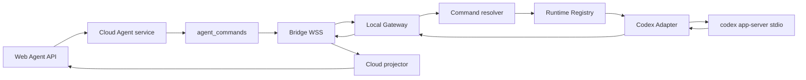

# 本地网关设计

> 状态：设备配对、Runtime HMAC 准入、Cloud WSS、持久游标、固定 schema、Codex Adapter、本地运行入口、Cloud Agent 聚合/API/projector 与只读资源快照已实现；Web UI 待后续批次  
> 范围：Local Gateway、Codex app-server Adapter 与 Cloud/本地边界；不包含 Web UI  
> 前置合同：[目标架构](./01-architecture.md)、[Codex app-server 接入](./02-codex-app-server.md)、[协议与数据模型](./03-protocol-and-data-model.md)

当前源码入口为 `packages/agent-bridge`。已实现并带原生 Node/Go 测试的范围：严格 `AgentCommand` 输入解析、
`AgentCommand -> ProviderCommand` 本地解析、Runtime Registry、Workspace canonical path/symlink 边界、持久且不可重绑的
source ref、带 hash 与 `fsync` 的分段 WAL、command result cache/recovery、Ed25519 设备配对、一次性 WSS 凭据、双向
连续游标、官方 `0.147.0` 生成 schema 和漂移校验、Codex lifecycle/turn/interaction/resource mapper、stdio JSONL
RPC、`pair/run` 入口，以及绑定现有 `identity_users.public_id` 的实时 Sub2 Key HMAC 准入证明。Cloud 的
AgentThread/Turn/Event/Interaction 聚合、幂等命令 API、事件 projector 与只读资源快照已经实现；Web UI、文件传输、
分享、审计和清理任务仍按本文后续批次推进。

## 1. 决策

不新增 `WorkCommand`、`WorkEvent` 或另一套 Provider 接口。沿用现有四层合同：

```text
Browser typed intent
  -> Cloud AgentCommand
  -> Local ProviderCommand
  -> provider protocol

provider notification/request/result
  -> Local ProviderEvent
  -> Cloud AgentEvent / AgentInteraction projection
  -> Browser
```

- Web 只调用统一 Agent HTTP API，并只消费 `AgentEvent`、`AgentInteraction` 和资源投影。
- Cloud 根据当前用户与 Thread 绑定的 Device、Runtime Profile、Workspace 校验并生成 `AgentCommand`。
- Local Gateway 根据 `profileId` 从 Runtime Registry 取得 `ProviderAdapter`，解析本地路径和 raw provider ID，生成 `ProviderCommand`。
- Adapter 才负责把 `ProviderCommand` 转成 Codex app-server 或以后其他 Provider 的协议。
- Adapter 输出统一 `ProviderEvent`；Cloud projector 再分配 Thread 范围内的 `AgentEvent.seq`。

因此“根据当前情况选择适配器”分为两步：Cloud 选择并校验目标 Profile，本地 Runtime Registry 选择实际
Adapter。Cloud 不加载 Codex Adapter，也不持有 canonical cwd、provider auth、raw thread/turn/request ID。



普通 `/chat` 继续使用 `Conversation / Message / Run` 和 Sub2 Chat execution。它不经过 Local Gateway，也不
复用 Agent 状态机。

## 2. 责任边界

| 组件 | 负责 | 不负责 |
| --- | --- | --- |
| Browser | 提交 typed intent；读取投影；回答 approval/input | provider、raw ID、cwd、任意 JSON-RPC |
| Cloud Agent service | ownership、状态/能力校验、幂等、命令持久化、顺序和投影 | 启动本地进程、读取本地配置、协议转换 |
| Local Gateway | 设备连接、Profile 生命周期、WAL、ref 解析、Adapter 路由、恢复 | 用户登录、订阅/余额、Chat、云端业务投影 |
| ProviderAdapter | provider 启停、命令映射、事件归一化、能力 manifest | WSS、Cloud 数据库、Browser DTO |
| Codex app-server | Codex thread/turn/item、工具、审批、本地资源 | DEEIX 用户/设备/订阅所有权 |

一个 AgentThread 创建后固定 `deviceId + profileId + workspaceId`。切换 Provider 或设备必须显式 fork/import，
不能在活动 Thread 内热切换 Adapter，否则历史 source ref、cwd 和审批关联会失去唯一解释。

## 3. 进程与目录

Local Gateway 使用仓库现有 TypeScript/Node 工具链，代码包保持 `packages/agent-bridge`。这样可以直接消费
`codex app-server generate-ts` 生成类型，并使用 Node 标准库处理 stdio、WSS、文件与信号。

```text
packages/agent-bridge/
  src/index.ts
  src/config/workspace-registry.ts
  src/wal/durable-wal-store.ts
  src/transport/wss-client.ts
  src/protocol/bridge-envelope.ts
  src/providers/provider-adapter.ts
  src/providers/provider-registry.ts
  src/providers/codex/codex-adapter.ts
  src/providers/codex/rpc-client.ts
  src/providers/codex/method-registry.ts
  src/providers/codex/event-mapper.ts
  src/commands/resolve-provider-command.ts
  src/commands/recovery-registry.ts
  src/resources/redaction.ts
  generated/codex-app-server-v<VERSION>/
  fixtures/codex/
```

首版只运行一个 Gateway 进程，每个 Runtime Profile 对应一个 Provider 子进程。不同 Codex home/provider 配置
使用不同 Profile，不在运行时改写某个已启动进程的环境。

发布包包含固定 Node runtime；用户不必另装 Node。Codex CLI/app-server 是独立前置条件，Gateway 启动时校验
其版本和 schema lock。

## 4. 本地数据

默认目录：

```text
Windows  %LOCALAPPDATA%/DEEIX/bridge/
macOS    ~/Library/Application Support/DEEIX/bridge/
Linux    ${XDG_STATE_HOME:-~/.local/state}/deeix/bridge/
```

```text
config.json              Cloud URL、device public ref、非秘密偏好
device.key               本机 Ed25519 私钥
profiles.json            profile ref、provider kind、可执行文件位置
workspaces.json          workspace ref 到 canonical root 的本地映射
state.snapshot           cursor、结果缓存和 source-ref 映射快照
wal/incoming-*.jsonl     Cloud command 与执行状态
wal/outgoing-*.jsonl     尚未被 Cloud 连续确认的 durable frame
logs/bridge.log          轮转后的脱敏诊断日志
```

首版不引入本地数据库依赖。WAL 使用分段追加 JSONL；每条记录含版本、长度、payload 和 SHA-256。关键状态遵循：

1. 追加临时 segment 并 `fsync` 后才推进 receipt cursor。
2. snapshot 写到临时文件，`fsync` 后原子 rename，再回收已确认 segment。
3. 启动只读取完整且 hash 正确的记录；损坏尾记录隔离并报告。
4. raw ID 映射必须先持久化，再发送首次引用对应 source ref 的上行事件。
5. 达到磁盘上限时进入 `degraded_storage`，停止接受新 Turn，继续排空已持久化上行帧。

该 WAL 只负责 Local Gateway 的 crash/reconnect durability，不是服务端部署数据库。

`device.key`、provider auth、canonical path 和 raw provider ID 不上传。Gateway 不写 Codex `config.toml`、auth
文件、环境变量、keychain、Skills 根目录或 MCP credentials。

## 5. Runtime Registry 与 Adapter

复用 [02](./02-codex-app-server.md#2-local-adapter-boundary) 已定义的 `ProviderAdapter`，不再定义第二个 interface。
Registry 只是运行中 Profile 到 Adapter 实例的映射：

```ts
const adapters = new Map<string, ProviderAdapter>();

function createAdapter(profile: LocalRuntimeProfile): ProviderAdapter {
  switch (profile.provider) {
    case "codex":
      return new CodexAdapter(profile);
  }
}
```

只有实现第二个 Provider 时才增加第二个 `case`。不增加 factory、DI 容器、transport adapter 或单实现 interface。

命令解析顺序固定：

1. 校验 envelope schema、大小、device/profile 绑定与连续 `serverSeq`。
2. 将 sanitized `AgentCommand` 以 `received` 状态写入 incoming WAL 并 `fsync`。
3. 由 `resolve-provider-command.ts` 校验全部 public/source refs。
4. 从 workspace registry 解析 canonical cwd，从 source mapping 解析 raw provider ID。
5. 生成判别联合 `ProviderCommand`；它不含 Cloud ownership 字段和 `unknown` payload。
6. 从 Registry 取 Adapter，再执行 capability 与当前状态校验。
7. 写入 `invocation_started` 后调用 `adapter.execute`。
8. terminal result/error 先缓存，再形成 durable 上行帧。

`transfer.execute` 属于 Gateway transport，不进入 `ProviderAdapter`。它只处理 ticket/receipt 和有界数据传输。

## 6. 统一命令与事件

`AgentCommand` 的定义继续以 [02 的判别联合](./02-codex-app-server.md#2-local-adapter-boundary) 为唯一权威。
Browser 不提交 command kind；HTTP handler 根据 route 与已绑定 Thread 创建对应命令。

第一阶段执行路径覆盖：

```text
thread.create / lifecycle / rename / compact
turn.start / steer / interrupt
review.start
interaction.respond
resource.refresh
transfer.execute (Gateway transport only)
```

`POST /threads` 带初始输入时也不把输入塞入 `thread.create`：Cloud 先保存 `awaiting_thread` provisional turn；
Bridge 返回 thread source ref 后，再通过唯一条件转换创建一次 `turn.start`。这保证崩溃恢复时不会重复创建 thread/turn。

Provider notification、server request、result 与 error 先由 Adapter mapper 转为 `ProviderEvent`，再封装为带
`bridgeSeq` 的 durable frame。Cloud projector 按连续 `bridgeSeq` 应用后才生成 Web 可见的 `AgentEvent`：

```text
runtime/profile status
thread and turn lifecycle
item started/delta/completed
plan/diff/usage updates
interaction requested/resolved
resource snapshot/invalidation
normalized warning/error
```

raw provider JSON 只可作为有界、脱敏、已登记 disposition 的诊断信息，不能成为 Thread/Turn/Item 的业务事实。
Item 和 Turn 的 completed 事件为终态；迟到 delta 不覆盖终态。

Provider 发起 approval、user input 或 MCP elicitation 时：

1. Gateway 先持久化 raw request ID 到本地 source mapping。
2. 上行统一 `interaction.requested(sourceRequestRef)`，Cloud 投影 `AgentInteraction`。
3. Web 调统一 respond API，Cloud 创建 `interaction.respond`。
4. Gateway 将 source request ref 解析回 raw JSON-RPC request ID，由 Codex Adapter 返回类型化结果。

Web 永远看不到 JSON-RPC request ID。

## 7. Codex Adapter

### 7.1 启动

1. 校验 Codex 可执行文件版本和仓库 pin 的 app-server schema hash。
2. 启动 `codex app-server`，只使用默认 stdio JSONL；stderr 进入本地脱敏日志。
3. 发送 `initialize`，收到结果后发送 `initialized`；首版不启用 `experimentalApi`。
4. 读取 account、models、permission profiles、config requirements 与首版只读资源，形成 `ProviderManifest`。
5. Runtime auth proof 通过后 Profile 才进入 `ready`。
6. reconcile 未决 invocation，然后才继续按 `serverSeq` drain command。

使用 stdio 是稳定边界：进程生命周期和本地权限由 Gateway 控制，app-server 不暴露网络监听；官方 WebSocket
transport 仍属于 experimental surface。

### 7.2 映射

| Agent/Provider command | Codex app-server |
| --- | --- |
| `thread.create` | `thread/start` |
| thread lifecycle | `thread/resume`、`thread/fork`、`thread/archive`、`thread/unarchive`、`thread/delete` |
| `thread.rename` | `thread/name/set` |
| `turn.start` | 必要时 `thread/resume`，随后 `turn/start` |
| `turn.steer` / `turn.interrupt` | `turn/steer` / `turn/interrupt` |
| `interaction.respond` | 回应本地保存的 server request ID |
| models / permissions | `model/list` / `permissionProfile/list` |
| skills / hooks | `skills/list` / `hooks/list` |
| MCP | `mcpServerStatus/list` |
| apps | `app/installed` / `app/list` |
| auth status / proof | `getAuthStatus`（普通投影不含 token；proof 调用只在内存短暂取 token） |

完整稳定性和 disposition 以 [schema lock](./codex-app-server-v0.147.0.lock.json) 与 [02 方法矩阵](./02-codex-app-server.md#3-method-matrix)
为准。升级 Codex 必须一起重新生成 TypeScript/JSON schema、更新 hash lock、补 recorded fixture，并让 exhaustive
registry 为每个新 union member 标记 `mapped`、`diagnostic` 或 `disabled`。

## 8. 配对与 Runtime Auth

Gateway 首次运行生成 Ed25519 device key。用户从已登录 DEEIX 页面取得一次性 enrollment code 后执行：

```text
deeix-bridge pair --server https://HOST --code PAIR_CODE
deeix-bridge run
```

后续连接使用设备私钥签署一次性 challenge，换取短时、单次 WSS connection credential。credential 放在
`Sec-WebSocket-Protocol`，不进入 URL、日志或 `config.json`；WSS 始终由本地向 Cloud 发起。

设备身份不等于 Runtime auth。`getAuthStatus` 只能说明 Codex 的 auth mode，不能证明当前 key 属于当前
DEEIX/Sub2 User。复用 [08](./08-clean-slate-identity-commerce-runtime.md#63-只改-deeix-的-hmac-proof-of-possession) 的 HMAC proof：

1. Cloud 发送绑定 user/device/profile/nonce/expiry 的 canonical challenge。
2. Gateway 的版本固定只读 auth reader 在内存取得 Codex 实际使用的 API key。
3. Gateway 返回 `HMAC-SHA-256(apiKey, challenge)`，不返回 key。
4. Cloud 使用当前 User 的 Sub2 session 实时读取有效 keys，逐个计算并常量时间比较。
5. 恰好一个匹配时签发短期 Profile proof lease；新 Turn 只在 lease 有效时派发。

proof、raw key 和候选 key 不落库/日志。auth rotation、`account/updated`、重连和 lease 到期触发重新证明；失败只
停止新 Agent command，不改 Codex 配置，也不切换到 Chat key。

挑战中的用户字段直接使用现有 `identity_users.public_id`（例如 `f6f910e920934def9a5cda479fc25251`）；数据库归属外键继续使用
`identity_users.id`。Cloud 只保存匹配到的 Sub2 Key ID、服务端加盐指纹和 proof lease，不保存 Key 原文或 proof。

## 9. 顺序、背压与恢复

WSS 沿用 [03](./03-protocol-and-data-model.md#3-wss-and-credentials) 的 `BridgeEnvelope`：

```text
Cloud -> Gateway: serverSeq
Gateway -> Cloud: bridgeSeq
Cloud -> Web thread: AgentEvent.seq (thread_seq)
```

三个序号互不替代。Gateway 只有在 incoming WAL `fsync` 后才推进连续 `ackServerSeq`；Cloud 只有在 durable frame
成功投影后才推进连续 `ackBridgeSeq`。outgoing WAL 只在收到 Cloud 连续确认后回收。

内存队列有固定上限。durable event 堆积时暂停读取 app-server stdout 形成背压，不丢事件；ping/pong/ack 使用
独立小控制队列，避免数据流量阻断心跳。

Incoming command 状态固定为：

```text
received -> invocation_started -> terminal_cached
```

- 命中 `terminal_cached`：重发缓存结果，不调用 Provider。
- `received` 且没有 invocation marker：允许首次执行。
- `invocation_started` 且没有 terminal：进入按 command kind 登记的 recovery handler。
- 只读 snapshot/read：可重试。
- `thread.create`、`turn.start`：先对账 thread catalog/read、source mapping、输入 hash 与时间；不能唯一证明时返回
  `outcome_unknown`，不盲目重发。
- interaction response：按本地 request mapping 与 resolved 状态对账，不确定时不重复回答。

app-server 退出时 Profile 进入 `process_error`，使用带 jitter 的指数退避重启，最大 30 秒。重新 initialize、auth
proof、资源刷新和 recovery 完成后才恢复执行。Cloud WSS 断开不终止已经运行的 Turn；事件先进入 outgoing WAL，
重连后续传。

## 10. Workspace 边界

- Workspace 只在本机 picker/discovery 注册；Gateway canonicalize 并解析 symlink/junction 后保存 root。
- Cloud command 只携带 opaque `workspaceId`，resolver 才补入 canonical cwd。
- writable roots 只能来自注册 Workspace 和本地 policy，Browser 不能自由扩展。
- provider 绝对路径只转换为 workspace-relative display path；越出 root 的路径不进入普通事件。
- 文件传输使用 opaque `fileRef`、短期 ticket、方向/大小/hash/MIME 校验，不接受 Browser 传绝对路径。
- 第一阶段只同步 Thread 投影、命令输出、Diff 与明确选取的 artifact，不镜像整个工作区。

## 11. 生命周期

```text
Gateway: starting -> pairing_required -> connecting -> online -> degraded -> stopped
Profile: discovering -> starting -> proving_auth -> ready
                              |          |-> auth_mismatch
                              |-> schema_mismatch
                              |-> process_error -> restarting
```

只有 `ready` Profile 接收执行命令。离线或未证明时，Cloud 保留历史投影并把新工作保持为明确等待状态，不把
Runtime 错误归类成余额或普通 Chat 错误。

## 12. 实现顺序与首个验收

1. 建立 package、Bridge envelope、分段 WAL 与 crash fixture。
2. 实现 enrollment、device challenge、出站 WSS、cursor、背压和重连。
3. 实现 workspace/source resolver、Runtime Registry 与 Profile 生命周期。
4. 生成并锁定 Codex schema，实现 stdio RPC client、initialize、manifest 和 HMAC proof。
5. 实现 thread/turn/item、interaction 和只读资源 mapper。
6. 完成 duplicate command、每个 crash point、WSS reconnect、app-server restart 和 schema drift 测试。

最小端到端验收：一台已配对设备、一个 `ready` Codex Profile、一个 Workspace。Cloud 发出统一 `turn.start` 后，
本地 Codex 执行并完整返回统一 Item 流；中途断开 WSS 后事件不丢失、Turn 不重复执行，未决审批在恢复后仍可回答。

第一阶段不开放任意 JSON-RPC、shell/process、config/auth/skill/MCP credential 写操作，不启用未锁定 experimental
API，不让 Cloud 直接连接 app-server，也不为未来 Provider 写空实现。
